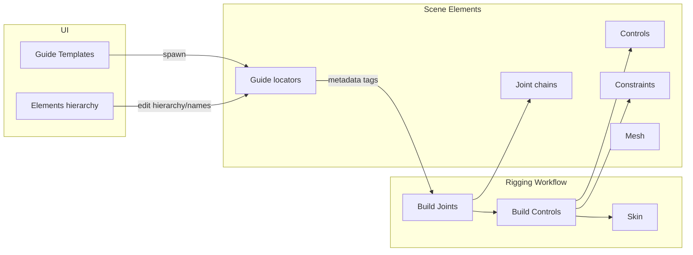
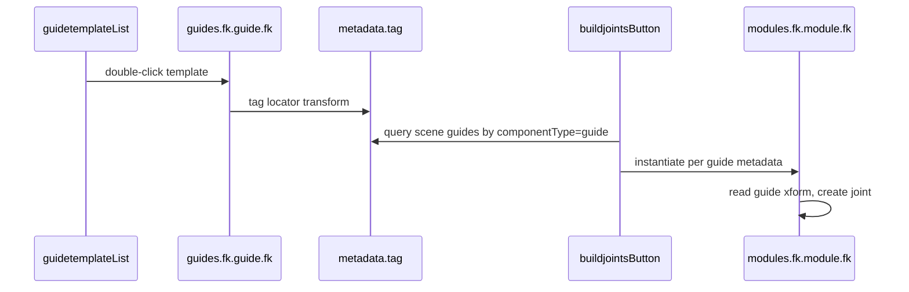
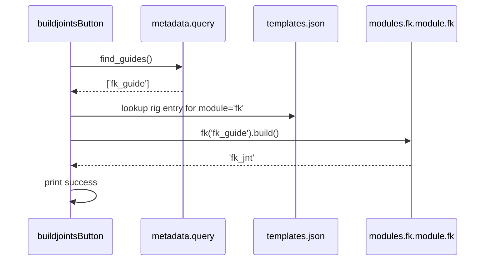
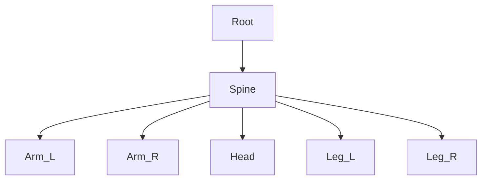

# RigBox Structured Project Plan

## Manual Implementation Workflow

**You code; I guide and review.** This plan is retained as the shared roadmap. Work through it one phase at a time on your own, then check back when you believe a phase is complete.

### How to work through each phase

1. **Read the phase section** below — goal, tasks, and exit criteria.
2. **Implement manually** in your repo. Use the plan as a checklist, not a copy-paste source. Deviate when you have a better approach; note what you changed when you check in.
3. **Self-test against exit criteria** in Maya before checking in (e.g. for Phase 0: UI opens, FK template spawns a tagged locator).
4. **Check back** with a message like: *"Phase 0 done — please review"* or *"Stuck on guidetemplateList JSON parsing in Phase 0"*.
5. **At check-in, I will:**
  - Review your changes against the phase exit criteria
  - Flag bugs, gaps, or inconsistencies with the architecture
  - Answer questions or unblock you on a specific task
  - Confirm the phase is done (or list what remains) before you start the next phase
6. **I will not implement phases for you** unless you explicitly ask (e.g. *"please fix the import error"* or *"go ahead and implement Phase 0"*).

### What to include when you check in

- Which phase you completed (or where you're stuck)
- Brief note on what you changed and any design decisions you made
- Result of your self-test (pass/fail and what you observed)
- Optional: `git diff` summary or specific files you want reviewed

### Suggested pace


| Phase | You are done when…                                                               |
| ----- | -------------------------------------------------------------------------------- |
| **0** | UI opens; FK template double-click creates tagged `fk_guide` locator             |
| **1** | Build Joints creates a joint at the FK guide's position                          |
| **2** | FK module subclasses a shared `module` base; new modules follow the same pattern |
| **3** | Build Controls creates a driven FK control                                       |
| **4** | Elements tree shows guides; rename/reparent works                                |
| **5** | Root → Spine → limb guides build a connected skeleton                            |
| **6** | Skin binds selected mesh to RigBox joints                                        |
| **7** | Camera or Metahuman guide works end-to-end                                       |
| **8** | Install path documented; shelf button launches UI                                |


**Start with Phase 0.** When ready, check in and we'll verify before moving to Phase 1.

### Phase 0 quick checklist (your first task)

- [x] Delete `guides/base.py` and `guides/fk.py` (keep `guides/base/guide.py` and `guides/fk/guide.py`)
- [x] Fix `tag.create(...)` in `guides/base/guide.py` — tag the Maya transform, not `self`
- [x] Fix `ui/mainWindowUI.py` imports (`guidetemplateList`, `buildjointsButton`)
- [x] Fix `guidetemplateList.py` to read `template['tool call']['guide']`
- [x] Fix `modules/base/module.py` control creation (`cmds.circle()`)
- [x] Verify: `show()` opens UI; double-click **fk** spawns `fk_guide` with metadata attrs

---

## Design Goals (from [RigBox_Design_Chart.pdf](.cursor/rules/RigBox_Design_Chart.pdf))

RigBox is a modular Maya autorigger built around three concepts:




**Core principles:**

- **Guides** are parentable, modular locators placed in the viewport; each carries metadata (`componentType`, `module`, `subModule`, `side`) that tells RigBox which scripts to run and what data to pass (transforms, names).
- **Modules** build joints, controls, and constraints from guide data.
- **UI** exposes template spawning, scene guide management, and the three build steps.
- **Target rig types:** FK, FK Chain, IK Chain, Root, Spine, Arm, Leg, Head (humanoid), plus Metahuman and Camera as specialized guides.

---

## Current State Assessment


| Layer                  | Status                                                                             | Key files                                                            |
| ---------------------- | ---------------------------------------------------------------------------------- | -------------------------------------------------------------------- |
| Metadata tagging       | Working                                                                            | `[metadata/tag.py](metadata/tag.py)`                                 |
| Guide base class       | Partial — tags wrong target node                                                   | `[guides/base/guide.py](guides/base/guide.py)`                       |
| FK guide               | Minimal locator only                                                               | `[guides/fk/guide.py](guides/fk/guide.py)`                           |
| Module base            | Stub `joint`/`control` helpers; `control` uses invalid `createNode('nurbsCircle')` | `[modules/base/module.py](modules/base/module.py)`                   |
| Template registry      | Defined but not fully consumed                                                     | `[guides/templates.json](guides/templates.json)`                     |
| UI shell               | Broken imports, missing widgets                                                    | `[ui/mainWindowUI.py](ui/mainWindowUI.py)`                           |
| Build pipeline         | Not implemented                                                                    | `[ui/widgets/buildjointsButton.py](ui/widgets/buildjointsButton.py)` |
| Duplicate legacy files | Untracked conflicts with new layout                                                | `guides/base.py`, `guides/fk.py`                                     |


**Critical bugs blocking any pipeline work:**

1. `[ui/mainWindowUI.py](ui/mainWindowUI.py)` imports deleted `guideListWidget` and references `buildJointsButton` without importing it.
2. `[ui/widgets/guidetemplateList.py](ui/widgets/guidetemplateList.py)` reads `tool_call_path['module']` but JSON nests under `tool call.guide.module`.
3. `[guides/base/guide.py](guides/base/guide.py)` calls `tag.create(self, guide, ...)` — first arg is the Python class instance, not the Maya node; tags land on the wrong object.
4. No `modules/fk/` exists despite `[templates.json](guides/templates.json)` referencing `modules.fk.module.fk`.

---

## Phase 0 — Stabilize the Refactor

**Goal:** Clean, importable codebase with one consistent package layout.

- **Remove duplicate flat files:** Delete `[guides/base.py](guides/base.py)` and `[guides/fk.py](guides/fk.py)`; standardize on `guides/<type>/guide.py` inheriting from `[guides/base/guide.py](guides/base/guide.py)`.
- **Fix metadata tagging:** Change `tag.create(self, guide, ...)` to tag the guide transform (not shape, not Python `self`). Consider making `tag.create` a `@staticmethod` to prevent misuse.
- **Fix UI imports in `[ui/mainWindowUI.py](ui/mainWindowUI.py)`:**
  - Import `guidetemplateList` (replaces `guideListWidget`)
  - Import `buildjointsButton`
  - Wire widgets into layout (already partially done)
- **Fix `[guidetemplateList.py](ui/widgets/guidetemplateList.py)`:** Parse nested `tool call.guide` dict:

```python
guide_call = template['tool call']['guide']
guide_module = importlib.import_module(guide_call['module'])
guide_cls = getattr(guide_module, guide_call['class'])
guide_cls(**guide_call.get('args', {}))
```

- **Add minimal `__init__.py` exports** where needed so `import guides` and `import modules` resolve reliably from the repo root on `sys.path`.
- **Fix `modules/base/module.py` control creation:** Use `cmds.circle()` (returns transform + shape) instead of `cmds.createNode('nurbsCircle')`.

**Exit criteria:** `from ui.mainWindowUI import show; show()` opens without errors; double-clicking "fk" in the template list creates a tagged `fk_guide` locator in the scene.

---

## Phase 1 — FK End-to-End Pipeline (First Milestone)

**Goal:** Template spawn → scene guide → Build Joints → FK joint chain in scene. This validates the entire architecture with the simplest module before adding complexity.




### 1a. Scene query layer (`metadata/`) — detailed breakdown

Add `[metadata/query.py](metadata/query.py)` alongside `[metadata/tag.py](metadata/tag.py)`. This file is the **read** side of metadata — `tag.py` writes attrs, `query.py` finds nodes and reads them back.

#### Why this exists

When Build Joints runs, it needs to answer two questions without hardcoding guide names:

1. **Which nodes in the scene are RigBox guides?**
2. **What data does each guide carry** (module type, side, world position)?

Your guides already stamp answers onto the transform at creation time in `[guides/base/guide.py](guides/base/guide.py)`:


| Attribute       | Written value (FK example) |
| --------------- | -------------------------- |
| `componentType` | `"guide"`                  |
| `module`        | `"fk"`                     |
| `subModule`     | `""` (empty when None)     |
| `side`          | `""` (empty when None)     |


The query layer searches for nodes with `componentType == "guide"` and packages their data for modules.

#### File structure

Create one new file: `metadata/query.py`

Match the style of `tag.py` — a class with `@staticmethod` methods (or plain module-level functions if you prefer; stay consistent with `tag`).

```python
# metadata/query.py
import maya.cmds as cmds

GUIDE_COMPONENT_TYPE = 'guide'

# Attribute names — keep in sync with guides/base/guide.py
ATTR_COMPONENT_TYPE = 'componentType'
ATTR_MODULE = 'module'
ATTR_SUBMODULE = 'subModule'
ATTR_SIDE = 'side'


class query:
    @staticmethod
    def is_guide(node):
        ...

    @staticmethod
    def find_guides(module=None):
        ...

    @staticmethod
    def read_guide_data(node):
        ...
```

#### Function 1: `is_guide(node)` (helper — recommended)

A small guard used by the other two functions. Checks a single transform before you read attrs.

**Logic:**

1. Return `False` if `node` is None or the node doesn't exist (`cmds.objExists(node)`).
2. Return `False` if the node doesn't have a `componentType` attribute (`cmds.attributeQuery(..., exists=True)`).
3. Return `True` only if `cmds.getAttr(f'{node}.componentType') == 'guide'`.

**Why not just check for a locator?** Future guides might use different shapes. The metadata attr is the contract.

#### Function 2: `find_guides(module=None)`

Returns a **list of transform node names** (strings) for all guides in the scene.

**Step-by-step logic:**

1. Get candidate transforms — `cmds.ls(type='transform')` or `cmds.ls(transforms=True)`.
2. For each transform, call `is_guide(node)`.
3. If `module` argument is provided, also check `cmds.getAttr(f'{node}.module') == module`.
4. Return the filtered list.

`**module` filter example:**

```python
find_guides()           # all guides: ['fk_guide', 'root_guide', ...]
find_guides('fk')       # only FK guides: ['fk_guide']
```

**Performance note:** For now, iterating all transforms is fine. RigBox scenes will be small. Optimize later if needed.

#### Function 3: `read_guide_data(node)`

Takes a **guide transform name** and returns a **dict** that modules and the build orchestrator can consume.

**Step-by-step logic:**

1. Validate with `is_guide(node)` — raise `ValueError` with a clear message if not a guide.
2. Read string attrs via `cmds.getAttr`:
  - `module`, `subModule`, `side`
3. Read world-space transform via `cmds.xform`:
  - `translation = cmds.xform(node, q=True, ws=True, t=True)`  → `[x, y, z]`
  - `rotation = cmds.xform(node, q=True, ws=True, ro=True)`   → `[rx, ry, rz]`
4. Return a dict shaped to match `modules/base/module.py` joint helper:

```python
{
    'node': 'fk_guide',           # Maya node name (useful for logging/parenting)
    'module': 'fk',
    'subModule': '',
    'side': '',
    'xform': {
        'translation': [0.0, 10.0, 0.0],
        'rotation': [0.0, 0.0, 0.0],
    },
}
```

The nested `xform` dict is intentional — your `joint` class already expects `xform['translation']` and `xform['rotation']`.

#### Suggested implementation sketch

```python
@staticmethod
def read_guide_data(node):
    if not query.is_guide(node):
        raise ValueError(f'{node} is not a RigBox guide')

    return {
        'node': node,
        'module': cmds.getAttr(f'{node}.{ATTR_MODULE}'),
        'subModule': cmds.getAttr(f'{node}.{ATTR_SUBMODULE}'),
        'side': cmds.getAttr(f'{node}.{ATTR_SIDE}'),
        'xform': {
            'translation': cmds.xform(node, q=True, ws=True, t=True),
            'rotation': cmds.xform(node, q=True, ws=True, ro=True),
        },
    }
```

#### How to test manually in Maya (before wiring Build Joints)

After spawning an FK guide via the UI:

```python
from metadata.query import query

# Should return ['fk_guide'] (or whatever you named it)
print(query.find_guides())

# Should return only FK-type guides
print(query.find_guides('fk'))

# Should print the full data dict with current viewport position
print(query.read_guide_data('fk_guide'))
```

Move `fk_guide` in the viewport, run `read_guide_data` again — translation values should update.

#### Edge cases to handle


| Case                                         | Behavior                                                                                           |
| -------------------------------------------- | -------------------------------------------------------------------------------------------------- |
| `subModule` / `side` were `None` at creation | Stored as `""` by `tag.create` — `getAttr` returns empty string, not `None`                        |
| Node renamed in Outliner                     | `find_guides` still works (searches by attr, not name); pass the current name to `read_guide_data` |
| Duplicate module guides                      | `find_guides('fk')` returns all of them — Build Joints will process each (correct for now)         |
| Non-guide node passed to `read_guide_data`   | Raise `ValueError` — don't silently return partial data                                            |
| Guide referenced by long path `grp1          | fk_guide`                                                                                          |


#### What NOT to put in query.py yet

- Template JSON loading (that belongs in the build orchestrator, step 1c)
- Joint creation (that belongs in `modules/fk/module.py`, step 1b)
- Qt/UI code

Keep `query.py` as a pure Maya scene-query utility with no UI dependencies.

#### 1a exit criteria

- [ ] `metadata/query.py` exists with `find_guides` and `read_guide_data`
- [ ] `find_guides()` returns spawned guide transforms
- [ ] `find_guides('fk')` filters correctly
- [ ] `read_guide_data('fk_guide')` returns module metadata + current world xform
- [ ] Moving the guide updates translation in subsequent `read_guide_data` calls

### 1b. FK module (`modules/fk/module.py`) — detailed breakdown

Create `modules/fk/module.py` with class `fk`. This is the first **rig module** — it takes a guide node and produces a joint in the scene.

#### Why this exists

`metadata/query.py` reads guide data. The FK module **acts** on that data — it is the first half of the Build Joints pipeline (the orchestrator in 1c will call it).

```
fk_guide (locator + metadata)
    → query.read_guide_data('fk_guide')
    → modules.fk.module.fk(guide_node).build()
    → fk_jnt (joint at guide position)
```

`templates.json` already registers the rig entry:

```json
"rig": {
    "module": "modules.fk.module",
    "class": "fk",
    "args": { "name": "fk", "module": "fk" }
}
```

No JSON changes needed for 1b — just create the Python module at that path.

#### Files to create

```
modules/
├── base/
│   └── module.py      # existing joint/control helpers
└── fk/
    ├── __init__.py    # can stay empty
    └── module.py      # NEW — class fk
```

#### Class design

Match existing conventions: lowercase class name `fk` (same as `guides.fk.guide.fk`).

**Constructor** — accept the guide transform node name (string). The build orchestrator (1c) will pass this after calling `find_guides()`.

```python
class fk:
    def __init__(self, guide_node):
        self.guide_node = guide_node
        self.data = query.read_guide_data(guide_node)
        self.joint = None

    def build(self):
        ...
```

Use a `build()` method rather than doing everything in `__init__` — 1c will call `build()` explicitly, and Phase 3 will add `build_controls()` alongside it.

**Why call `read_guide_data` inside the module?** Keeps the orchestrator thin — it only needs to pass the guide node name. The module owns how it interprets guide data.

#### `build()` step-by-step

1. **Derive joint name** from guide metadata:
  ```python
   # FK guide: module='fk', node='fk_guide' → 'fk_jnt'
   jnt_name = f'{self.data["module"]}_jnt'
  ```
   For a single FK guide this is sufficient. Later, sided limbs might use `f'{self.data["side"]}_{self.data["module"]}_jnt'`.
2. **Create the joint** using the existing helper from `modules.base.module`:
  ```python
   from modules.base.module import joint

   jnt = joint(jnt_name, self.data['xform'])
   self.joint = jnt.joint   # joint class stores node on .joint
  ```
   The `joint` helper already applies world-space translation/rotation from `data['xform']`.
3. **Return or store** the joint node on `self.joint` for Phase 3 (Build Controls).

#### Full implementation sketch

```python
'''FK Module for RigBox'''

from metadata.query import query
from modules.base.module import joint


class fk:
    def __init__(self, guide_node):
        self.guide_node = guide_node
        self.data = query.read_guide_data(guide_node)
        self.joint = None

    def build(self):
        jnt_name = f'{self.data["module"]}_jnt'
        jnt = joint(jnt_name, self.data['xform'])
        self.joint = jnt.joint
        return self.joint
```

#### Naming note: `joint` helper vs `self.joint`

`modules.base.module.joint` is a **class** that creates joints. Its instance attribute is also called `.joint` (the Maya node name). This is slightly confusing but matches your existing code — use a local variable like `jnt` to keep it readable:

```python
jnt = joint(jnt_name, self.data['xform'])  # jnt is the helper instance
self.joint = jnt.joint                      # self.joint is the Maya node string
```

#### How to test manually in Maya (before wiring Build Joints button)

This tests 1b in isolation without needing 1c:

```python
# 1. Spawn a guide via UI (or manually)
from guides.fk.guide import fk as fk_guide
fk_guide(name='fk', module='fk')

# 2. Move fk_guide where you want the joint, then build
from modules.fk.module import fk as fk_module

builder = fk_module('fk_guide')
jnt = builder.build()
print(jnt)  # 'fk_jnt'

# 3. Verify position matches
import maya.cmds as cmds
print(cmds.xform('fk_guide', q=True, ws=True, t=True))
print(cmds.xform('fk_jnt', q=True, ws=True, t=True))
# translation values should match
```

Move `fk_guide`, run `build()` again — you'll get a duplicate `fk_jnt` (Maya auto-renames to `fk_jnt1`). That's expected for now; preventing duplicate builds is a later concern.

#### Edge cases to be aware of


| Case                      | Behavior for now                                                                     |
| ------------------------- | ------------------------------------------------------------------------------------ |
| Guide moved after spawn   | `read_guide_data` reads current xform at build time — joint matches current position |
| Build called twice        | Creates duplicate joints — acceptable for 1b; add guards in a later phase            |
| Invalid guide node passed | `read_guide_data` raises `ValueError` — let it propagate                             |
| `side` is empty string    | Ignore for FK single joint; use in naming later for limbs                            |
| Joint parent              | `parent=None` for now — FK root joint has no parent; hierarchy comes in Phase 5      |


#### What NOT to put in this file yet

- Template JSON loading (1c)
- UI / button wiring (1c)
- Tagging the joint with metadata (Phase 2 naming conventions)
- Control creation (Phase 3)
- Parenting to other joints (Phase 5)

Keep `modules/fk/module.py` focused: guide node in → joint out.

#### Relationship to Phase 2

Phase 2 will refactor this into a `module` base class with `build()` as an abstract contract. Your FK module will become `class fk(module)`. The logic stays the same — only the inheritance changes. Don't wait for Phase 2 to finish 1b.

#### 1b exit criteria

- [x] `modules/fk/module.py` exists with class `fk`
- [x] `fk(guide_node).build()` creates a joint named `fk_jnt`
- [x] Joint world position matches `fk_guide` at build time
- [x] `self.joint` stores the Maya node name for later use
- [x] Manual test in Script Editor passes before wiring the button (1c)

### 1c. Build Joints orchestrator — detailed breakdown

Wire the **Build Joints** button so the full Phase 1 pipeline runs from the UI — no Script Editor required.

#### End-to-end flow




#### What you're building

Replace the stub `print('Build Joints Button Clicked')` in `[ui/widgets/buildjointsButton.py](ui/widgets/buildjointsButton.py)` with orchestration logic that:

1. Finds all guides in the scene
2. Resolves which rig module each guide needs (from `templates.json`)
3. Dynamically imports and calls `.build()` on each

#### Key design decision: where does the logic live?

**Option A — all in the button widget** (fine for now, ~25–40 lines)

Keep everything in `on_build_joints_button_clicked()`. Simplest for 1c.

**Option B — shared orchestrator** (recommended if button handler exceeds ~40 lines)

Create `build.py` at repo root with `build_joints()` function. Button just calls it. Build Controls (Phase 3) will reuse the same pattern.

For 1c, either works. If you choose Option B:

```
rigbox/
├── build.py              # NEW (optional)
└── ui/widgets/
    └── buildjointsButton.py   # calls build.build_joints()
```

#### Step 1: Load `templates.json`

Reuse the same pattern as `[guidetemplateList.py](ui/widgets/guidetemplateList.py)`:

```python
import json
import os
import guides

with open(os.path.join(guides.__path__[0], 'templates.json'), 'r') as f:
    template_data = json.load(f)
```

Load once — either in the button widget's `__init__` (store as `self.template_data`) or inside the click handler.

#### Step 2: Build a rig lookup table

Template keys (`"fk"`, `"ik chain"`, `"Root"`) don't match guide `module` attrs (`"fk"`, `"ik"`, `"root"`). **Don't index by template key** — search by the `module` value stored on the guide.

When loading JSON, build a dict keyed by module name:

```python
def _build_rig_lookup(template_data):
    lookup = {}
    for template in template_data['templates'].values():
        rig_call = template['tool call']['rig']
        module_name = rig_call['args']['module']   # 'fk', 'ik', 'root', ...
        lookup[module_name] = rig_call
    return lookup

# Result:
# { 'fk': { 'module': 'modules.fk.module', 'class': 'fk', 'args': {...} },
#   'ik': { ... }, 'root': { ... }, 'spine': { ... } }
```

#### Step 3: Find guides in the scene

```python
from metadata.query import query

guides_in_scene = query.find_guides()
if not guides_in_scene:
    print('RigBox: No guides found in scene.')
    return
```

#### Step 4: For each guide — resolve, import, build

```python
import importlib

for guide_node in guides_in_scene:
    guide_data = query.read_guide_data(guide_node)
    module_name = guide_data['module']          # e.g. 'fk'

    rig_call = rig_lookup.get(module_name)
    if rig_call is None:
        print(f'RigBox: No rig template for module "{module_name}" on {guide_node}')
        continue

    rig_module = importlib.import_module(rig_call['module'])
    rig_cls = getattr(rig_module, rig_call['class'])

    builder = rig_cls(guide_node)    # pass guide node — NOT rig_call['args']
    joint = builder.build()
    print(f'RigBox: Built {joint} from {guide_node}')
```

**Important:** Your `fk` module constructor takes the **guide node name** (`guide_node`), not the JSON `args` dict. The `args` in `templates.json` are for future use — ignore them for 1c.

This mirrors how `guidetemplateList` imports guides — same `importlib` pattern, different JSON sub-key (`rig` instead of `guide`).

#### Step 5: Put it in the button handler

**Option A sketch** — logic directly in widget:

```python
def on_build_joints_button_clicked(self):
    rig_lookup = self._build_rig_lookup(self.template_data)
    guides_in_scene = query.find_guides()
    ...
```

Store `template_data` in `__init__` (load JSON there, same as guidetemplateList).

**Option B sketch** — thin button, fat orchestrator:

```python
# build.py
def build_joints():
    ...

# buildjointsButton.py
def on_build_joints_button_clicked(self):
    build.build_joints()
```

#### Don't forget: button layout

If the Build Joints button isn't visible in the UI, add a layout in `buildjointsButton.widget`:

```python
def create_layout(self):
    layout = QtWidgets.QVBoxLayout(self)
    layout.addWidget(self.build_joints_button)
```

Call `create_layout()` from `__init__`.

#### Full click handler sketch (Option A, self-contained)

```python
import importlib
import json
import os

import guides
from metadata.query import query


class widget(QtWidgets.QWidget):
    def __init__(self):
        super().__init__()
        with open(os.path.join(guides.__path__[0], 'templates.json'), 'r') as f:
            self.template_data = json.load(f)
        self.create_widgets()
        self.create_layout()
        self.create_connections()

    def _rig_lookup(self):
        lookup = {}
        for template in self.template_data['templates'].values():
            rig_call = template['tool call']['rig']
            lookup[rig_call['args']['module']] = rig_call
        return lookup

    def on_build_joints_button_clicked(self):
        rig_lookup = self._rig_lookup()
        guides_in_scene = query.find_guides()

        if not guides_in_scene:
            print('RigBox: No guides found in scene.')
            return

        for guide_node in guides_in_scene:
            module_name = query.read_guide_data(guide_node)['module']
            rig_call = rig_lookup.get(module_name)
            if not rig_call:
                print(f'RigBox: No rig for module "{module_name}" ({guide_node})')
                continue

            rig_module = importlib.import_module(rig_call['module'])
            rig_cls = getattr(rig_module, rig_call['class'])
            joint = rig_cls(guide_node).build()
            print(f'RigBox: Built {joint} from {guide_node}')
```

#### How to test end-to-end in Maya

1. `from ui.mainWindowUI import show; show()`
2. Double-click **fk** in Guide Templates → `fk_guide` appears
3. Move `fk_guide` in the viewport
4. Click **Build Joints**
5. Script Editor should print: `RigBox: Built fk_jnt from fk_guide`
6. `fk_jnt` should be at `fk_guide`'s world position

#### Edge cases to handle


| Case                                                                 | Behavior                                                                         |
| -------------------------------------------------------------------- | -------------------------------------------------------------------------------- |
| No guides in scene                                                   | Print message, return early — don't error                                        |
| Guide module has no rig entry (e.g. `ik` guide but no `modules/ik/`) | Print warning, `continue` to next guide                                          |
| Multiple FK guides                                                   | Loop builds one joint per guide (duplicate names get Maya auto-suffix `fk_jnt1`) |
| `importlib` fails (module doesn't exist)                             | Let traceback show in Script Editor for now; add try/except in Phase 8           |
| Click Build Joints with no guides spawned                            | Graceful message, no crash                                                       |


#### What NOT to do in 1c

- Don't pass `**rig_call['args']` to the rig class — your `fk` module expects `guide_node` only
- Don't hardcode `modules.fk.module` — always resolve from JSON + guide metadata
- Don't add Build Controls logic yet (Phase 3)
- Don't refactor FK guide hardcoding (that's 1d — optional, can do after 1c works)

#### 1c exit criteria

- [x] Build Joints button triggers orchestration (not just a print stub)
- [x] Spawning FK guide + clicking button creates `fk_jnt` at guide position
- [x] Module resolved from `templates.json` via guide's `module` attr (not hardcoded)
- [x] Script Editor prints success message per built joint
- [x] No guides in scene → graceful message, no crash

#### Phase 1 complete when 1c passes

After 1c, the full Phase 1 milestone is done:

> Open UI → spawn FK guide → move it → Build Joints → joint at guide position

Step 1d (FK guide improvements) is optional polish — you can do it before or after checking in Phase 1.

### 1d. FK guide improvements — detailed breakdown

Optional polish after Phase 1c. The pipeline already works — this step makes guides more flexible and hierarchy-ready before Phase 5 (humanoid modules).

#### What's wrong today

```python
# guides/fk/guide.py (current)
def __init__(self, name, module, submodule=None, side=None):
    name = 'fk'       # overwrites template args
    module = 'fk'     # overwrites template args
    super().__init__(name, module, submodule, side)
```

`templates.json` passes `"name": "fk", "module": "fk"` but the FK guide ignores them. This works for a single FK template but breaks the pattern every other module will follow — guides should trust their template args.

#### Goal

1. FK guide passes template args through to `guide` base class unchanged
2. New guides can parent under the current Maya selection (for future Root → Spine → Limb hierarchies)

---

#### Task 1: Remove hardcoding in `guides/fk/guide.py`

**Simplest fix** — FK guide becomes a thin pass-through (like many module guides will be):

```python
''' FK Guide Element'''

from guides.base.guide import guide


class fk(guide):
    def __init__(self, name, module, submodule=None, side=None):
        super().__init__(name, module, submodule, side)
```

That's it for the FK class itself. `templates.json` already provides the right args:

```json
"args": {
    "name": "fk",
    "module": "fk"
}
```

**Verify after change:** Double-clicking **fk** in the UI still creates `fk_guide` with `module=fk` metadata. Behavior should be identical — you're removing dead code, not changing output.

**Why keep the `fk` subclass at all?** It gives you a dedicated file to add FK-specific guide logic later (e.g. multiple locators for FK chain). For now it can be empty beyond `__init__`.

---

#### Task 2: Parent under Maya selection (recommended in base class)

When building humanoid rigs, users will select a parent guide before spawning a child (e.g. select `spine_guide` → spawn `arm_guide` → arm parents under spine).

**Where to add it:** [`guides/base/guide.py`](guides/base/guide.py) — all guide types benefit, not just FK.

**When:** After rename, before storing `self.guide`:

```python
def create(self):
    guide = cmds.createNode('locator')
    guide_transform = cmds.listRelatives(guide, parent=True)[0]

    tag.create(guide_transform, 'componentType', 'guide', locked=True)
    tag.create(guide_transform, 'module', self.module, locked=True)
    tag.create(guide_transform, 'subModule', self.submodule, locked=True)
    tag.create(guide_transform, 'side', self.side, locked=True)

    cmds.rename(guide_transform, self.name)
    guide_transform = self.name   # rename returns new name; update reference

    selection = cmds.ls(selection=True)
    if selection:
        cmds.parent(guide_transform, selection[0])

    self.guide = guide_transform
    return guide_transform
```

**Notes:**
- Only parent if something is selected — otherwise guide stays at world origin (current behavior)
- Use `selection[0]` — first selected node is the parent
- Update `guide_transform` after rename (Maya returns the new name from `cmds.rename`)

**Manual test:**
1. Spawn an FK guide → `fk_guide` at origin
2. Select `fk_guide` in the outliner
3. Spawn another FK guide → should appear parented under `fk_guide` in the hierarchy
4. Build Joints on both → each still builds a joint at its world position (parenting doesn't break xform read)

---

#### Task 2 alternative: FK-only parenting

If you prefer not to touch the base class yet, override `create()` in `guides/fk/guide.py`:

```python
class fk(guide):
    def __init__(self, name, module, submodule=None, side=None):
        super().__init__(name, module, submodule, side)

    def create(self):
        guide_transform = super().create()
        selection = cmds.ls(selection=True)
        if selection:
            cmds.parent(guide_transform, selection[0])
        return guide_transform
```

**Recommendation:** Put it in the base class — every future guide (Root, Spine, Arm) needs this behavior.

---

#### What NOT to change in 1d

- `templates.json` — already correct for FK
- `modules/fk/module.py` — no changes needed
- `modules/build.py` — no changes needed
- Joint naming or build pipeline — unchanged

---

#### Optional stretch goals (skip if you want to move to Phase 2)

| Enhancement | Purpose |
|-------------|---------|
| Pass `side` in template args | `{"name": "fk", "module": "fk", "side": "left"}` — tests metadata on sided guides |
| Custom `name` per spawn | `name="arm"` → `arm_guide` — prepare for limb templates |
| Select new guide after spawn | `cmds.select(self.guide)` in base `create()` — UX convenience |

---

#### 1d exit criteria

- [ ] `guides/fk/guide.py` no longer hardcodes `name` / `module`
- [ ] UI spawn still creates `fk_guide` with correct metadata
- [ ] Build Joints still works end-to-end (regression check)
- [ ] (Recommended) Selecting a guide before spawning parents the new guide underneath it

#### Relationship to Phase 2

Phase 1d is independent of Phase 2. You can do 1d now or skip straight to Phase 2 — the FK pipeline does not depend on 1d. Parenting in the base guide class will save rework before Phase 5 (humanoid hierarchy).

## Phase 2 — Module Base Class and Shared Rig Infrastructure

**Goal:** Replace ad-hoc per-module logic with a consistent module contract before adding Root, Spine, IK, etc.

### 2a. `modules/base/module.py` refactor

Evolve the current loose `joint`/`control` functions into a proper base:

```python
class module:
    def __init__(self, guide_node, metadata: dict):
        self.guide = guide_node
        self.metadata = metadata
        self.xform = self._read_xform()

    def build(self):
        raise NotImplementedError

    def _read_xform(self): ...
    def _create_joint(self, name, parent=None): ...
    def _create_control(self, name, parent=None): ...
```

Each concrete module (`fk`, `root`, `spine`, ...) subclasses `module` and implements `build()`.

### 2b. Rig output conventions

Establish naming and grouping conventions early (applies to all future modules):

- Joint suffix: `_jnt`
- Control suffix: `_ctrl`
- Top-level group: `rig_GRP` (or per-module groups parented under it)
- Tag built nodes with `componentType` values: `joint`, `control`, `constraint` (per design chart element types)

### 2c. Fix and extend metadata schema

Document the attribute contract on guide nodes:


| Attribute       | Example | Purpose                            |
| --------------- | ------- | ---------------------------------- |
| `componentType` | `guide` | Identifies node role               |
| `module`        | `fk`    | Maps to `templates.json` rig entry |
| `subModule`     | `chain` | Sub-type within module             |
| `side`          | `left`  | Limb laterality                    |


**Exit criteria:** FK module uses base class; adding a new module requires only a new `guides/<type>/` + `modules/<type>/` pair and a `templates.json` entry.

---

## Phase 3 — Build Controls Pipeline

**Goal:** Second step of the design chart workflow — controls driven by existing joints.

- Add **Build Controls** button widget (mirror of `buildjointsButton`).
- FK module `build_controls()` (or separate `modules/fk/controls.py`):
  - Find joints tagged/linked to the guide.
  - Create nurbs-curve control at joint position.
  - Parent constraint or orient constraint joint → control (FK behavior).
- Reuse the same `templates.json` `tool call.rig` lookup; modules expose `build()` for joints and `build_controls()` for controls, or a staged `build(stage='joints'|'controls')` API.

**Exit criteria:** After Build Joints, Build Controls creates a driven FK control for the FK module.

---

## Phase 4 — Elements UI Widget

**Goal:** Design chart requirement — spawned guides appear in an Elements widget where hierarchy and names can be edited.

Create `[ui/widgets/elementsList.py](ui/widgets/elementsList.py)`:

- `QTreeWidget` showing guide hierarchy (parent/child relationships in Maya scene).
- Refresh on guide spawn and after Build Joints.
- Inline rename (updates Maya node name + metadata if needed).
- Drag-reparent in tree → `cmds.parent` in scene.
- Selection sync: selecting tree item selects Maya guide.

Wire into `[ui/mainWindowUI.py](ui/mainWindowUI.py)` below the template list.

**Exit criteria:** Spawning multiple FK guides shows them in a tree; renaming and reparenting in UI updates the scene.

---

## Phase 5 — Humanoid Guide and Module Suite

**Goal:** Expand beyond single FK to the body-part modules listed in the design chart.

Build in dependency order (each module depends on guides below it in the hierarchy):




| Module        | Guide behavior                                                  | Joint output                             |
| ------------- | --------------------------------------------------------------- | ---------------------------------------- |
| **Root**      | Single locator at pelvis/root                                   | 1 root joint                             |
| **Spine**     | Multi-locator chain or parametric count                         | Hips → spine chain                       |
| **FK Chain**  | N locators in a chain                                           | FK joint chain following guide positions |
| **IK Chain**  | 3+ locators (start/mid/end)                                     | IK joint chain with pole vector guide    |
| **Arm / Leg** | Composite guides (clavicle/upper/lower/hand or thigh/shin/foot) | Limb chains, sided via `side` metadata   |
| **Head**      | Neck + head locators                                            | Neck/head joints                         |


For each: create `guides/<type>/guide.py`, `modules/<type>/module.py`, and register in `[templates.json](guides/templates.json)`.

**Multi-guide modules** (Spine, Arm, Leg): the guide class may spawn multiple child locators in `create()`, all tagged with the same `module` but different `subModule` values. The module reads all related guides and builds the joint chain.

**Exit criteria:** User can spawn Root → Spine → Limb guides, parent them, Build Joints produces a connected humanoid skeleton.

---

## Phase 6 — Skin Workflow

**Goal:** Third design chart step — bind mesh to built skeleton.

- Add **Skin** button to UI.
- Implement `modules/skin/` or a utility in `metadata/`:
  - Collect all joints tagged `componentType == joint`.
  - Bind selected mesh (or mesh in a `bindMesh` set) via `cmds.skinCluster`.
- Minimal first version: bind selected mesh to all RigBox joints; later add weight transfer and max influences.

**Exit criteria:** With skeleton built and mesh selected, Skin produces a working `skinCluster`.

---

## Phase 7 — Specialized Guides

**Goal:** Design chart special cases — Metahuman and Camera rigs.

These are independent of the humanoid chain and can be developed in parallel once Phase 1–2 patterns are stable:

- **Camera guide:** Locators for camera body, aim, up; module builds camera + aim constraint rig.
- **Metahuman guide:** Spawns UE5 Mannequin skeleton proportions and a functional control rig. Largest scope item — treat as its own sub-project with its own template entry and module package (`guides/metahuman/`, `modules/metahuman/`).

---

## Phase 8 — Polish and Distribution

- **Maya module descriptor:** Add `rigbox.mod` or documented `sys.path` setup so users can install without manual path hacks.
- **Shelf button:** One-liner to `from ui.mainWindowUI import show; show()`.
- **Error handling in UI:** Validate missing modules, untagged nodes, and failed imports with user-visible dialogs.
- **Empty `__init__.py` cleanup:** Export public API surface.

---

## Recommended File Layout (target)

```
rigbox/
├── guides/
│   ├── templates.json
│   ├── base/guide.py
│   ├── fk/guide.py
│   ├── ik/guide.py
│   ├── root/guide.py
│   ├── spine/guide.py
│   ├── arm/guide.py
│   ├── leg/guide.py
│   ├── head/guide.py
│   ├── camera/guide.py
│   └── metahuman/guide.py
├── modules/
│   ├── base/module.py
│   ├── fk/module.py
│   ├── ik/module.py
│   ├── root/module.py
│   ├── spine/module.py
│   └── ...
├── metadata/
│   ├── tag.py
│   └── query.py          # new: scene guide/joint queries
├── ui/
│   ├── mainWindowUI.py
│   └── widgets/
│       ├── guidetemplateList.py
│       ├── elementsList.py    # new
│       ├── buildjointsButton.py
│       ├── buildcontrolsButton.py  # new
│       └── skinButton.py           # new
└── build.py                # optional shared orchestrator
```

---

## Implementation Order Summary


| Phase | Deliverable                                    | Depends on |
| ----- | ---------------------------------------------- | ---------- |
| **0** | Refactor stabilized, UI opens, FK guide spawns | —          |
| **1** | FK Build Joints end-to-end                     | Phase 0    |
| **2** | Module base class + metadata query API         | Phase 1    |
| **3** | Build Controls for FK                          | Phase 2    |
| **4** | Elements tree widget                           | Phase 1    |
| **5** | Humanoid modules (Root → Spine → limbs)        | Phase 2    |
| **6** | Skin binding                                   | Phase 5    |
| **7** | Camera + Metahuman                             | Phase 2    |
| **8** | Distribution + polish                          | All        |


Phases 3 and 4 can run in parallel after Phase 2. Phase 5 is the largest body of work and should begin only after the FK pipeline (Phase 1) and module base (Phase 2) are proven.