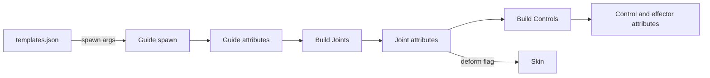
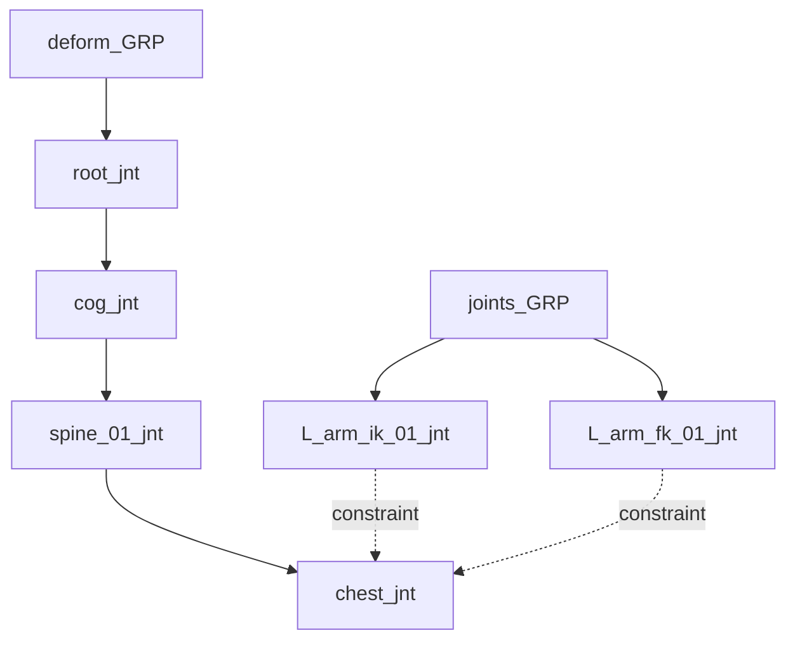

# RigBox Metadata Schema

The contract for RigBox scene metadata: which attributes live on which nodes, their Maya types and legal values, naming conventions, scene organization, and the query API.

**Status:** Target contract as of the 2026-08-06 plan reset. Sections marked **planned** are not yet in code — see [`PROGRESS.md`](../PROGRESS.md) for what is actually implemented.

**Related docs:** [`RIGBOX_PROJECT_PLAN.md`](RIGBOX_PROJECT_PLAN.md) · [`archive/METADATA_SCHEMA.md`](archive/METADATA_SCHEMA.md) (superseded)

---

## 1. Principles

Metadata is the interface between pipeline steps. A build step never guesses from node names or types; it queries attributes.



| Rule | Detail |
|------|--------|
| Target | Tag the **transform**, never the shape |
| Locking | Metadata attributes are locked after being written |
| Writer | `metadata.tag.tag.create()` |
| Reader | `metadata.query.query` |
| Empty values | Empty string for unset string attributes; enums always resolve to a real label |
| Renaming | Node names may change at any time. `guideNode` is the durable link between a built node and its guide |

---

## 2. Attributes

Six attributes make up the schema. Not every attribute applies to every node type.

| Attribute | Maya type | Applies to | Purpose |
|-----------|-----------|------------|---------|
| `componentType` | string | all | The node's role in the rig |
| `module` | string | all | Which module class the node belongs to |
| `subModule` | string | all | Which component within the module |
| `side` | enum | all | Orientation relative to the character |
| `guideNode` | string | joints, controls, effectors | Name of the source guide transform |
| `deform` | boolean | joints only | Whether the joint is used for skinning |
| `kinematics` | enum | joints, controls, effectors | Whether the node belongs to an IK or FK system |

### `componentType` — string

The node's role. Read this before trusting any other attribute.

| Value | Meaning | Created by |
|-------|---------|------------|
| `guide` | Placement locator | [`guides/base/guide.py`](../guides/base/guide.py) |
| `joint` | Skeleton joint | `module._create_joint()` |
| `control` | Animator-facing control curve | `module._create_control()` |
| `effector` | Non-animated rig node such as an IK handle or pole vector | **planned** — Phase 8 |

### `module` — string

The class of module the node belongs to. Matches the `module` argument in [`guides/templates.json`](../guides/templates.json), which is how the build orchestrator resolves the module script to call.

Values: `fk`, `fkchain`, `root`, `spine`, `headneck`, `shoulder`, `arm`, `finger`, `leg`, `foot`.

### `subModule` — string

Which component within the module a node represents. This is what lets a multi-guide module tell its own guides apart.

| Module | Example `subModule` values |
|--------|----------------------------|
| `fk` | empty |
| `fkchain` | `chain_01`, `chain_02`, … |
| `root` | empty |
| `spine` | `cog`, `spine_01`, `spine_02`, `chest` |
| `headneck` | `neck_01`, `neck_02`, `neck_03`, `head` |
| `shoulder` | empty |
| `arm` | `upper_arm`, `lower_arm`, `wrist` |
| `finger` | `index_metacarpal`, `index_01`, `index_02`, `index_03` |
| `leg` | `upper_leg`, `lower_leg`, `ankle` |
| `foot` | `ankle`, `ball`, `toe`, `roll_inner`, `roll_outer`, `roll_toe`, `roll_heel` |

Use lowercase with underscores. Segment numbering is zero-padded to two digits so that string sorting matches build order.

### `side` — enum

Orientation relative to the character.

| Index | Label | Meaning |
|-------|-------|---------|
| 0 | `none` | Side is not meaningful for this node |
| 1 | `center` | On the character's midline |
| 2 | `left` | Character's left |
| 3 | `right` | Character's right |

Two nodes whose metadata matches except for `left` versus `right` are considered **mirrored elements**. The Phase 10 mirroring utility relies on this.

Enum rather than string so Maya's channel box shows a dropdown and typos are impossible.

### `guideNode` — string

The name of the guide transform a built node came from. Written on joints, controls, and effectors; never on guides.

This is the pairing key used by `find_joint_for_guide` and its siblings. When a guide is renamed, every `guideNode` referencing it must be updated — [`ui/widgets/elementsList.py`](../ui/widgets/elementsList.py) already does this on rename.

### `deform` — boolean

**Joint only.** True when the joint should be a skin influence.

The Skin step uses this as its sole source of truth. In a limb, only the bind chain is tagged true; the IK and FK chains that drive it are false. Reverse-foot and other helper joints are false.

This flag also decides where a joint lives: `deform = true` joints form the contiguous deform skeleton under `deform_GRP` and join the `deform_skeleton` selection set, while `deform = false` joints go under `joints_GRP`. See section 5.

### `kinematics` — enum

Whether a joint, control, or effector participates in an IK or FK system.

| Index | Label | Meaning |
|-------|-------|---------|
| 0 | `none` | Not part of a kinematic chain |
| 1 | `FK` | Forward kinematics |
| 2 | `IK` | Inverse kinematics |
| 3 | `IKFK` | Blended or switchable |

A limb bind joint that is driven by a blend of both chains is `IKFK`; the two driver chains are `FK` and `IK` respectively.

---

## 3. Attributes by node type

| Attribute | Guide | Joint | Control | Effector |
|-----------|-------|-------|---------|----------|
| `componentType` | yes | yes | yes | yes |
| `module` | yes | yes | yes | yes |
| `subModule` | yes | yes | yes | yes |
| `side` | yes | yes | yes | yes |
| `guideNode` | no | yes | yes | yes |
| `deform` | no | yes | no | no |
| `kinematics` | no | yes | yes | yes |

Guides do not carry `kinematics` because a single guide can drive both IK and FK output; the module decides.

---

## 4. Naming conventions

Constants live in [`modules/base/module.py`](../modules/base/module.py).

| Constant | Value |
|----------|-------|
| `GUIDE_SUFFIX` | `_guide` |
| `JOINT_SUFFIX` | `_jnt` |
| `CONTROL_SUFFIX` | `_ctrl` |
| `EFFECTOR_SUFFIX` | `_eff` |

### Rule

Guides are named `{name}_guide`. Built nodes take the guide's name, **strip `_guide`**, and append their own suffix. Built node names never contain the word `guide`.

| Guide transform | Joint | Control |
|-----------------|-------|---------|
| `fk_guide` | `fk_jnt` | `fk_ctrl` |
| `fk_guide1` | `fk1_jnt` | `fk1_ctrl` |
| `L_upperArm_guide` | `L_upperArm_jnt` | `L_upperArm_ctrl` |

**Why strip rather than derive from the `module` attribute:** every guide transform name is unique in Maya, so stripping guarantees a unique built-node name per guide. Deriving from `module` gives every FK guide the same base name, which is the collision that made guide-to-node pairing unreliable before the reset.

### Multi-part names

Modules that create several nodes from one guide pass a part string:

```python
self._joint_name()          # fk_jnt
self._joint_name('ik')      # fk_ik_jnt
self._control_name('pv')    # fk_pv_ctrl
```

---

## 5. Scene organization

### Groups

All four groups are **siblings at the scene root**. None of them is ever moved, rotated, or scaled.

| Group | Holds | Parenting |
|-------|-------|-----------|
| `guides_GRP` | All guides | Root guides directly under the group; child guides under their parent guide |
| `deform_GRP` | The deform skeleton | **Only the single skeleton root joint** is a direct child; every other deform joint parents to its parent deform joint |
| `joints_GRP` | Driver joints — IK chains, FK chains, reverse foot pivots, twist and helper joints | Root driver joints directly under the group; child driver joints under their parent driver joint |
| `rig_GRP` | All controls and effectors | Root controls directly under the group; child controls under the parent guide's control |

Joint and control hierarchies **mirror** the guide hierarchy. Reparenting a guide and rebuilding reparents its joint and control to match.

### Why `deform_GRP` is separate and flat at the top

Game export is a project requirement, and the deform skeleton is what gets exported. Two rules follow from that, and both are easy to violate by accident:

**One contiguous joint chain.** "Deform joints are nested under `deform_GRP`" does **not** mean every deform joint is a direct child of the group. Parenting them all directly to the group would flatten the skeleton into a list of unrelated joints, destroying both the bind hierarchy and the export. Only the skeleton **root** is a child of `deform_GRP`; the rest keep their joint-to-joint parenting.



**No foreign nodes inside the hierarchy.** Driver joints live under `joints_GRP` and reach the deform skeleton through constraints. A driver joint parented inside the deform hierarchy exports as an extra bone; a group transform between two deform joints exports as a junk node and breaks the bone chain.

`deform_GRP` is a **sibling** of `joints_GRP` rather than a child so the exported skeleton sits one level below the scene root with nothing above it but an identity transform. Exporting is then "select the skeleton root and the mesh, export selected."

> **Constraint nodes:** Maya parents a `parentConstraint` node under the joint it constrains, so constraint nodes will appear inside the deform hierarchy. FBX export handles these once animation is baked. If they become a problem, connect `offsetParentMatrix` instead of using constraint nodes, which leaves the skeleton completely clean. Decide during Phase 9, when limbs introduce the first driver chains.

### Selection sets

| Set | Members |
|-----|---------|
| `deform_skeleton` | Every joint with `deform = true` |
| `controls` | Every node with `componentType = control` |

Sets are conveniences for animators and downstream tools. Attributes remain the source of truth; the sets are rebuilt from attributes, never the reverse.

---

## 6. Query API

Implemented in [`metadata/query.py`](../metadata/query.py).

```python
from metadata.query import query
```

### Attribute constants

| Constant | Value |
|----------|-------|
| `ATTR_COMPONENT_TYPE` | `componentType` |
| `ATTR_MODULE` | `module` |
| `ATTR_SUBMODULE` | `subModule` |
| `ATTR_SIDE` | `side` |
| `ATTR_GUIDE_NODE` | `guideNode` |
| `ATTR_DEFORM` | `deform` — **planned** |
| `ATTR_KINEMATICS` | `kinematics` — **planned** |

### Functions

| Function | Returns | Status |
|----------|---------|--------|
| `is_guide(node)` | bool | implemented |
| `is_joint(node)` | bool | implemented |
| `is_control(node)` | bool | implemented |
| `is_effector(node)` | bool | planned — Phase 1 |
| `find_guides(module=None)` | list | implemented |
| `find_joints(module=None)` | list | implemented |
| `find_controls(module=None)` | list | implemented |
| `find_effectors(module=None)` | list | planned — Phase 1 |
| `find_deform_joints()` | list | planned — Phase 1 |
| `read_guide_data(node)` | dict | implemented |
| `find_joint_for_guide(guide)` | str or None | implemented |
| `find_control_for_guide(guide)` | str or None | implemented |
| `find_parent_guide(guide)` | str or None | planned — Phase 2 |
| `sort_guides_hierarchy(guides)` | list | planned — Phase 2 |

### `read_guide_data` shape

```python
{
    'node': 'L_upperArm_guide',
    'module': 'arm',
    'subModule': 'upper_arm',
    'side': 'left',
    'xform': {
        'translation': [12.0, 140.0, 0.0],
        'rotation': [0.0, 0.0, 0.0],
    },
}
```

---

## 7. Reading typed attributes

`cmds.getAttr` returns an enum's **index**, not its label. Always resolve enums to labels before comparing, or compare against the index constants — never against a bare string that happens to look right.

```python
# Wrong: getAttr on an enum returns 2, never 'left'
cmds.getAttr(f'{node}.side') == 'left'

# Right: resolve through the enum labels
query.read_enum(node, ATTR_SIDE) == SIDE_LEFT
```

Booleans return Python `True` / `False` and need no conversion.

---

## 8. Worked example

A left arm's upper segment, after all four pipeline steps.

| Node | `componentType` | `module` | `subModule` | `side` | `guideNode` | `deform` | `kinematics` |
|------|-----------------|----------|-------------|--------|-------------|----------|--------------|
| `L_upperArm_guide` | `guide` | `arm` | `upper_arm` | `left` | — | — | — |
| `L_upperArm_jnt` | `joint` | `arm` | `upper_arm` | `left` | `L_upperArm_guide` | `true` | `IKFK` |
| `L_upperArm_fk_jnt` | `joint` | `arm` | `upper_arm` | `left` | `L_upperArm_guide` | `false` | `FK` |
| `L_upperArm_ik_jnt` | `joint` | `arm` | `upper_arm` | `left` | `L_upperArm_guide` | `false` | `IK` |
| `L_upperArm_fk_ctrl` | `control` | `arm` | `upper_arm` | `left` | `L_upperArm_guide` | — | `FK` |
| `L_arm_ik_eff` | `effector` | `arm` | `wrist` | `left` | `L_wrist_guide` | — | `IK` |

Only `L_upperArm_jnt` is in `deform_skeleton`. Only `L_upperArm_fk_ctrl` is in `controls`.
