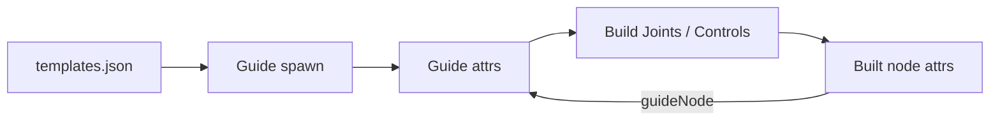

# RigBox Metadata Schema

Canonical reference for RigBox scene metadata — attributes on guides and built rig nodes, naming conventions, and the query API.

**Related docs:** [`PHASE_1_ARCHIVE.md`](PHASE_1_ARCHIVE.md) · [`PHASE_2B.md`](PHASE_2B.md) · [`PHASE_2C.md`](PHASE_2C.md)

---

## Overview

RigBox stores rig metadata as **locked string attributes** on Maya transforms. Attributes are written via `metadata.tag.tag.create()` and read via `metadata.query.query`.



| Node kind | `componentType` | Tagged by |
|-----------|-----------------|-----------|
| Guide | `guide` | `guides/base/guide.py` |
| Joint | `joint` | `modules/base/module.py` → `_create_joint()` |
| Control | `control` | `modules/base/module.py` → `_create_control()` |
| Constraint | `constraint` | *planned — Phase 5+* |

---

## Tagging rules

All RigBox metadata follows these rules regardless of node type:

| Rule | Detail |
|------|--------|
| Target node | Tag the **transform**, never the shape |
| Attribute type | Locked `string` via `cmds.addAttr(..., dataType="string")` |
| Empty values | `tag.create` stores `None` as `""` |
| Locking | All metadata attrs are locked (`locked=True`) by default |
| Writer | `metadata.tag.tag.create(target, longname, data, locked=True)` |

---

## Guide nodes

Applied when a guide is spawned in `guides/base/guide.py`.

| Attribute | Type | Example | Required | Purpose |
|-----------|------|---------|----------|---------|
| `componentType` | string | `guide` | yes | Identifies RigBox guide transforms |
| `module` | string | `fk` | yes | Maps to `templates.json` rig entry |
| `subModule` | string | `""` | yes | Sub-type within a module (e.g. spine segment, limb part) |
| `side` | string | `""` | yes | Laterality: `L`, `R`, or empty for center |

**Naming:** `{name}_guide` — e.g. template arg `name: "fk"` → transform `fk_guide`.

**Parenting:** Child guides parent under a selected parent guide via the `parent` kwarg passed from the UI (`ui/widgets/guidetemplateList.py`). Parenting only occurs when `query.is_guide(parent)` is true.

---

## Built nodes

Applied by `modules/base/module.py` → `_tag_node()` whenever `_create_joint()` or `_create_control()` runs.

| Attribute | Type | Example | Required | Purpose |
|-----------|------|---------|----------|---------|
| `componentType` | string | `joint` / `control` | yes | Identifies rig output type |
| `guideNode` | string | `fk_guide` | yes | Source guide transform name |
| `module` | string | `fk` | yes | Copied from the source guide |

### `componentType` values

| Value | Status | Created by |
|-------|--------|------------|
| `guide` | implemented | `guides/base/guide.py` |
| `joint` | implemented | `module._create_joint()` |
| `control` | implemented (helper exists; used in Phase 3) | `module._create_control()` |
| `constraint` | planned | future limb/IK modules |

### Known gap (planned)

Guides carry `subModule` and `side`; built joints and controls do **not** yet. Phase 5 limb modules will likely add these attrs to built nodes for scene filtering (e.g. `find_joints(module='arm', side='L')`).

---

## Naming conventions

Defined as class constants on `modules/base/module.py`:

| Constant | Value | Pattern | Example |
|----------|-------|---------|---------|
| — | — | Guide | `fk_guide` |
| `JOINT_SUFFIX` | `_jnt` | `{module}_jnt` or `{module}_{part}_jnt` | `fk_jnt`, `arm_upper_jnt` |
| `CONTROL_SUFFIX` | `_ctrl` | `{module}_ctrl` or `{module}_{part}_ctrl` | `fk_ctrl`, `arm_upper_ctrl` |
| `RIG_GROUP` | `rig_GRP` | Top-level control group | `rig_GRP` |

**Preferred API for subclasses:**

```python
self._create_joint(self._joint_name())           # → fk_jnt
self._create_joint(self._joint_name('upper'))    # → fk_upper_jnt
# Phase 3:
self._create_control(self._control_name())       # → fk_ctrl  (planned helper)
```

---

## Query API

Implemented in `metadata/query.py`. Import as:

```python
from metadata.query import query
```

### Attribute constants

| Constant | Value | Used on |
|----------|-------|---------|
| `ATTR_COMPONENT_TYPE` | `componentType` | guides, built nodes |
| `ATTR_MODULE` | `module` | guides, built nodes |
| `ATTR_SUBMODULE` | `subModule` | guides only |
| `ATTR_SIDE` | `side` | guides only |
| `ATTR_GUIDE_NODE` | `guideNode` | built nodes only |

### Type checks

| Function | Returns | Description |
|----------|---------|-------------|
| `is_guide(node)` | `bool` | `componentType == 'guide'` |
| `is_joint(node)` | `bool` | `componentType == 'joint'` |
| `is_control(node)` | `bool` | `componentType == 'control'` |

### Scene queries

| Function | Returns | Description |
|----------|---------|-------------|
| `find_guides(module=None)` | `list[str]` | All guide transforms; optional `module` filter |
| `find_joints(module=None)` | `list[str]` | All tagged joints; optional `module` filter |
| `find_controls(module=None)` | `list[str]` | All tagged controls; optional `module` filter |

### Readers

| Function | Returns | Description |
|----------|---------|-------------|
| `read_guide_data(node)` | `dict` | Full guide metadata; raises `ValueError` if not a guide |

**`read_guide_data` return shape:**

```python
{
    'node': str,           # guide transform name
    'module': str,         # e.g. 'fk'
    'subModule': str,      # e.g. '' or 'upper'
    'side': str,           # e.g. '', 'L', 'R'
    'xform': {
        'translation': [float, float, float],  # world space
        'rotation': [float, float, float],     # world space (degrees)
    }
}
```

### Planned

| Function | Returns | Description |
|----------|---------|-------------|
| `read_node_data(node)` | `dict` | Generic reader for any tagged rig node |

---

## `templates.json` linkage

Each template entry in `guides/templates.json` defines two tool calls:

```json
"tool call": {
    "guide": { "module": "...", "class": "...", "args": { "name": "...", "module": "..." } },
    "rig":   { "module": "...", "class": "...", "args": { "name": "...", "module": "..." } }
}
```

| Pipeline step | Uses | Match key |
|---------------|------|-----------|
| Guide spawn (UI double-click) | `tool call.guide` | — |
| Build Joints | `tool call.rig` | `rig.args.module` == guide's `module` attr |
| Build Controls *(Phase 3)* | `tool call.rig` | same |

The guide's `module` attribute is the bridge between scene nodes and `templates.json` rig entries.

**Working template:** `fk` — guide + module code complete through Phase 2b.

**Placeholders:** `ik chain`, `Root`, `Spine` — template entries exist; guide/module code pending Phase 5.

---

## Verification in Maya

After spawning `fk_guide` and running **Build Joints**:

```python
import maya.cmds as cmds
from metadata.query import query

# Guide attrs
query.is_guide('fk_guide')                        # True
query.read_guide_data('fk_guide')['module']       # 'fk'
cmds.getAttr('fk_guide.componentType')            # 'guide'

# Built joint attrs
cmds.getAttr('fk_jnt.componentType')              # 'joint'
cmds.getAttr('fk_jnt.guideNode')                  # 'fk_guide'
cmds.getAttr('fk_jnt.module')                     # 'fk'
query.is_joint('fk_jnt')                            # True
query.find_joints('fk')                           # ['fk_jnt']
```

Walk through every attribute row in this document against the Attribute Editor to confirm the live scene matches the schema.

---

## Future

| Item | Phase | Notes |
|------|-------|-------|
| `subModule` / `side` on built nodes | 5 | Limb and spine modules |
| `constraint` `componentType` | 5+ | IK/FK constraints |
| `find_controls()` | 3 | Build Controls pipeline |
| `read_node_data(node)` | optional | Generic reader for any tagged rig node |
| `rig_GRP` hierarchy rules | 3 | Controls parent under `rig_GRP` |
