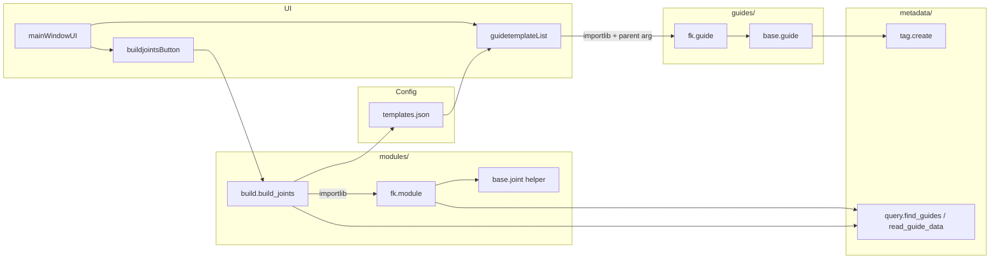

# RigBox Phase 0–1 Archive

Persistent context for agents and developers. Read this file when chat history is lost or when resuming after a break.

**Status:** Phases 0, 1, and 1d are **complete**. Phase 2 is **next**.  
**Workflow:** User writes Python source; agent guides, reviews, and may update `.md` progress docs only.  
**Last verified:** 2026-07-31  
**Reference commits:** `250a600` (Phase 0), `27fc411` (Phase 1), `b4d7037` (Phase 1d parenting)

---

## Architecture at end of Phase 1



**Design chart alignment (partial):** Guide → metadata → Build Joints → joint. Build Controls and Skin are Phase 3+.

---

## Directory layout (Phase 1 scope)

```
rigbox/
├── guides/
│   ├── templates.json          # Registry: tool call.guide + tool call.rig
│   ├── base/guide.py           # Base guide locator + tags + parenting
│   └── fk/guide.py             # Thin FK subclass
├── metadata/
│   ├── tag.py                  # Write locked string attrs on Maya nodes
│   └── query.py                # Read: find guides, read_guide_data
├── modules/
│   ├── base/module.py          # joint + control helpers (not base class yet)
│   ├── build.py                # build_joints orchestrator
│   └── fk/module.py            # FK rig: guide → joint
├── ui/
│   ├── mainWindowUI.py         # Dockable shell
│   └── widgets/
│       ├── guidetemplateList.py
│       └── buildjointsButton.py
├── PROGRESS.md                 # Short resume summary
└── docs/PHASE_1_ARCHIVE.md     # This file
```

**Not implemented yet (templates.json references only):** `guides/ik`, `guides/root`, `guides/spine`, and matching `modules/*`.

---

## Phase 0 — Stabilize refactor

### Goals
- Consistent package layout (`guides/<type>/guide.py`)
- UI opens without import errors
- FK template spawns tagged locator

### Completed work
| Task | Detail |
|------|--------|
| Remove duplicate flat files | Deleted `guides/base.py`, `guides/fk.py` |
| Fix `tag.create` target | Tags on guide **transform**, not Python `self` or shape |
| `tag.create` as `@staticmethod` | Prevents passing wrong first argument |
| UI imports | `guidetemplateList`, `buildjointsButton` in `mainWindowUI` |
| Template JSON parsing | Read `template['tool call']['guide']` (space in key name) |
| Control helper | `cmds.circle(constructionHistory=False)[0]` |
| Joint rename bug | `self.joint = cmds.rename(self.joint, name)` — capture return value |

### Phase 0 exit criteria (met)
- [x] `from ui.mainWindowUI import show; show()` — no errors
- [x] Double-click **fk** creates `fk_guide` with metadata attrs

---

## Phase 1 — FK end-to-end pipeline

### Sub-phases

| Step | Deliverable | File(s) |
|------|-------------|---------|
| **1a** | Scene query API | `metadata/query.py` |
| **1b** | FK rig module | `modules/fk/module.py` |
| **1c** | Build Joints orchestrator | `modules/build.py`, `buildjointsButton.py` |
| **1d** | Guide polish + parenting | `guides/base/guide.py`, `guides/fk/guide.py`, `guidetemplateList.py` |

### 1a — `metadata/query.py`

**`is_guide(node)`** — transform exists, has `componentType == 'guide'`

**`find_guides(module=None)`** — all guide transforms; optional filter by `module` attr

**`read_guide_data(node)`** — returns:

```python
{
    'node': 'fk_guide',
    'module': 'fk',
    'subModule': '',      # empty string when None at creation
    'side': '',
    'xform': {
        'translation': [x, y, z],   # NOT 'translate'
        'rotation': [rx, ry, rz],  # NOT 'rotate'
    },
}
```

Must match `modules/base/module.py` `joint()` helper keys.

### 1b — `modules/fk/module.py`

- Constructor: `fk(guide_node)` — guide transform name string
- Calls `query.read_guide_data` internally
- `build()` → creates `{module}_jnt` via `joint()` helper
- Stores result on `self.joint`

**Manual test (Script Editor):**
```python
from guides.fk.guide import fk as fk_guide
from modules.fk.module import fk as fk_module

fk_guide(name='fk', module='fk')
builder = fk_module('fk_guide')
builder.build()
```

### 1c — `modules/build.py`

**`build_joints()` flow:**
1. `query.find_guides()`
2. Build lookup: `rig_call['args']['module']` → `tool call.rig` entry
3. Per guide: `importlib` load `rig_call['module']`, `getattr` class, `rig_cls(guide_node).build()`
4. Pass **guide node only** — not `**rig_call['args']`

**`build` class API:**
- `build_joints()` — public entry from button
- `_load_templates()`, `_rig_lookup()` — private

**Button widget:** `self.builder = build()` in `__init__`; `QVBoxLayout` required or button invisible.

**JSON key:** `'tool call'` with a **space**, not `tool_call`.

### 1c exit criteria (met)
- [x] Build Joints runs orchestration from UI
- [x] FK guide + button → `fk_jnt` at guide world position
- [x] Module resolved from JSON via guide `module` attr

---

## Phase 1d — Guide improvements

### Goals
- FK guide trusts `templates.json` args (no hardcoded `name`/`module`)
- New guide parents under selected guide when spawning from UI

### Final parenting solution

**Problem:** Reading `cmds.ls(sl=True)` inside `guide.create()` fails — Qt UI double-click clears Maya selection before `create()` runs.

**Solution:** Capture selection in `guidetemplateList.on_item_clicked` **before** `guide_cls()`, pass as `parent` kwarg.

**`guidetemplateList.py`:**
```python
parent_guide = None
for node in cmds.ls(sl=True, transforms=True) or []:
    if query.is_guide(node):
        parent_guide = node
        break
call_args['parent'] = parent_guide
guide_cls(**call_args)
```

**`guide.__init__`:** `self.parent = parent` before `create()`

**`guide.create()`** after rename:
```python
if self.parent and self.parent != guide_transform and query.is_guide(self.parent):
    cmds.parent(guide_transform, self.parent)
```

**`fk/guide.py`:** `def __init__(..., parent=None): super().__init__(..., parent)`

### Bugs encountered and fixes (learning log)

| Bug | Cause | Fix |
|-----|-------|-----|
| `No object matches name: joint1` | `cmds.rename` return not assigned | `self.joint = cmds.rename(...)` |
| Parent to `fk_guideShape` | Selection included shape nodes | Use `transforms=True`; later use UI-captured parent |
| First guide under second | `guide_transform = self.name` after duplicate rename | `guide_transform = cmds.rename(...)` |
| Parenting never runs | Selection empty in `create()` | Pass `parent` from UI before spawn |
| `self.parent` never used | Not stored / not passed through fk / parenting inside empty selection loop | Store on self; pass through fk; parent **outside** selection loop |

### Phase 1d exit criteria (met)
- [x] No hardcoded `name`/`module` in FK guide
- [x] Spawn with selection → child guide under parent in Outliner
- [x] Build Joints still works

---

## Metadata contract

> **Canonical reference:** [`METADATA_SCHEMA.md`](METADATA_SCHEMA.md) — covers guides, built nodes, naming, and query API. The summary below is retained for Phase 0–1 context.

Applied on guide **transform** in `guides/base/guide.py`:

| Attribute | Example | Purpose |
|-----------|---------|---------|
| `componentType` | `guide` | Identifies RigBox guide nodes |
| `module` | `fk` | Maps to `templates.json` rig entry |
| `subModule` | `""` | Sub-type within module |
| `side` | `""` | Limb laterality (Phase 5+) |

`tag.create` stores `None` as empty string `""`.

---

## `templates.json` contract (Phase 1)

Each template has:
```json
"tool call": {
    "guide": { "module": "...", "class": "...", "args": { ... } },
    "rig":   { "module": "...", "class": "...", "args": { ... } }
}
```

- **Guide spawn:** uses `tool call.guide`
- **Build Joints:** uses `tool call.rig`, keyed by `rig.args.module` matching guide's `module` attr
- **FK args:** `{ "name": "fk", "module": "fk" }` → locator named `fk_guide`

Only **fk** has working guide + module code. ik/root/spine entries are placeholders for Phase 5.

---

## Launch in Maya

```python
import sys
sys.path.insert(0, r'D:\GitHub\rigbox')  # adjust path

from ui.mainWindowUI import show
show()
```

Requires PySide6/shiboken6 (Maya 2025+). Repo root on `PYTHONPATH`.

---

## Manual test checklist (regression)

1. [ ] `show()` — UI opens
2. [ ] Double-click **fk** — `fk_guide` with 4 locked string attrs
3. [ ] Select `fk_guide`, spawn second **fk** — `fk_guide1` under `fk_guide`
4. [ ] Move guide, **Build Joints** — `fk_jnt` at guide world position
5. [ ] Script Editor: `RigBox: Built fk_jnt from fk_guide`

---

## What Phase 2 will change (not done yet)

Phase 2 refactors `modules/base/module.py`:

- Introduce `class module` with `build()` contract
- `_create_joint`, `_create_control`, `_tag_node` on built nodes
- Naming: `_jnt`, `_ctrl`, `rig_GRP`
- `modules/fk/module.py` subclasses `module`

**Do not** re-apply bulk auto-implementation of Phases 2–8 (was reverted 2026-07-31).

---

## Agent resume protocol

1. Read [`PROGRESS.md`](../PROGRESS.md) for current phase pointer
2. Read this file for Phase 1 technical detail
3. Inspect listed key files if behavior unclear
4. User codes; agent reviews on check-in
5. Update `PROGRESS.md` after phase completion

**Resume phrase:** *"Resuming RigBox — read PROGRESS.md"*
