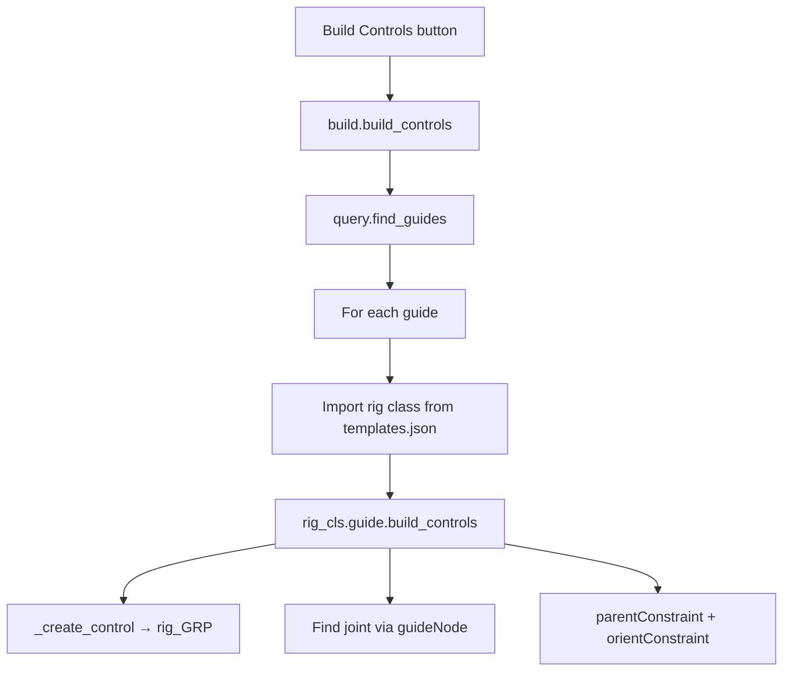

# Phase 3 — Build Controls Pipeline

Supplement to [`PROGRESS.md`](../PROGRESS.md). Phase 2 complete; you are here.

---

## Goal

Add a **Build Controls** step that runs after **Build Joints**:

1. Creates a tagged control per guide (`fk_ctrl`)
2. Parents controls under `rig_GRP`
3. Constrains the joint to follow the control (FK drive)

Same template-driven pattern as joints — UI button → `modules/build.py` → per-module `build_controls()`.

---

## Prerequisites

User workflow order:

```
Spawn guides → Build Joints → Build Controls
```

Joints must exist before controls. Phase 3 pairs controls to joints via the `guideNode` attribute on tagged joints.

---

## Architecture



| Layer | Responsibility |
|-------|----------------|
| `ui/widgets/buildcontrolsButton.py` | Button → calls `build().build_controls()` |
| `modules/build.py` | Loop guides, dispatch to rig class (mirror `build_joints`) |
| `modules/base/module.py` | `_control_name()`, optional `build_controls()` contract |
| `modules/fk/module.py` | FK control creation + constraint to joint |
| `metadata/query.py` | Optional `find_joint_for_guide(guide)` helper |

---

## Step 1 — `_control_name()` on base module

In `modules/base/module.py`, mirror `_joint_name()`:

```python
def _control_name(self, part=''):
    base = self.metadata['module']
    if part:
        return f'{base}_{part}{CONTROL_SUFFIX}'
    return f'{base}{CONTROL_SUFFIX}'
```

---

## Step 2 — Optional query helper

In `metadata/query.py`, add a convenience lookup (avoids duplicating `guideNode` logic in every module):

```python
@staticmethod
def find_joint_for_guide(guide_node):
    if not query.is_guide(guide_node):
        return None
    for joint in query.find_joints():
        if cmds.getAttr(f'{joint}.{ATTR_GUIDE_NODE}') == guide_node:
            return joint
    return None
```

---

## Step 3 — `build_controls()` on base module

Add a contract method on `module` (subclasses override):

```python
def build_controls(self):
    raise NotImplementedError('build_controls method not implemented')
```

---

## Step 4 — FK `build_controls()`

In `modules/fk/module.py`:

```python
def build_controls(self):
    self.joint = query.find_joint_for_guide(self.guide)
    if not self.joint:
        print(f'RigBox: No joint found for guide {self.guide}')
        return None

    self.control = self._create_control(
        self._control_name(),
        parent=self._rig_group()
    )

    cmds.parentConstraint(self.control, self.joint, maintainOffset=True)
    cmds.orientConstraint(self.control, self.joint, maintainOffset=True)

    return self.control
```

**Notes:**
- `self._rig_group()` creates `rig_GRP` if missing
- Constraints use `maintainOffset=True` — control and joint start at the same world xform
- Import `maya.cmds as cmds` in fk module if not already present

**Optional:** store `self.control = None` in `__init__` alongside `self.joint`.

---

## Step 5 — `build_controls()` orchestrator

In `modules/build.py`, add a method that mirrors `build_joints()`:

```python
def build_controls(self):
    guides_in_scene = query.find_guides()
    rig_lookup = self._rig_lookup()

    if not guides_in_scene:
        print('RigBox: No Guides Found in Scene')
        return

    for guide_node in guides_in_scene:
        module_name = query.read_guide_data(guide_node)['module']
        rig_call = rig_lookup.get(module_name)
        if not rig_call:
            print(f'RigBox: No Rig Call Found for "{module_name}" ({guide_node})')
            continue

        rig_module = importlib.import_module(rig_call['module'])
        rig_cls = getattr(rig_module, rig_call['class'])

        control = rig_cls(guide_node).build_controls()
        if control:
            print(f'RigBox: Built {control} from {guide_node}')
```

**Optional refactor:** extract shared guide-loop logic into `_build_for_guides(method_name)` to DRY `build_joints` and `build_controls`. Not required for Phase 3.

---

## Step 6 — UI button widget

Create `ui/widgets/buildcontrolsButton.py` — copy the pattern from `buildjointsButton.py`:

| Piece | Value |
|-------|-------|
| Button label | `Build Controls` |
| Click handler | `self.builder.build_controls()` |

Wire into `ui/mainWindowUI.py`:

```python
from ui.widgets import guidetemplateList, buildjointsButton, buildcontrolsButton

# create_widgets:
self.build_controls_button = buildcontrolsButton.widget()

# create_layout (below Build Joints):
main_layout.addWidget(self.build_controls_button)
```

---

## Files to touch

| File | Changes |
|------|---------|
| `modules/base/module.py` | `_control_name()`, `build_controls()` stub |
| `modules/fk/module.py` | `build_controls()` implementation |
| `metadata/query.py` | Optional `find_joint_for_guide()` |
| `modules/build.py` | `build_controls()` orchestrator |
| `ui/widgets/buildcontrolsButton.py` | **new** — button widget |
| `ui/mainWindowUI.py` | Import + layout new button |
| `docs/METADATA_SCHEMA.md` | Update verification section for controls *(optional)* |

No `templates.json` changes — same rig entry drives both build steps.

---

## How to test in Maya

1. `from ui.mainWindowUI import show; show()`
2. Double-click **fk** → `fk_guide` spawned
3. **Build Joints** → `fk_jnt` created and tagged
4. **Build Controls** → expect:
   - `rig_GRP` in Outliner (empty group at world origin)
   - `fk_ctrl` parented under `rig_GRP`
   - `fk_ctrl` has `componentType=control`, `guideNode=fk_guide`
   - Moving `fk_ctrl` moves `fk_jnt` (constraints working)

**Script Editor checks:**

```python
from metadata.query import query
import maya.cmds as cmds

query.is_control('fk_ctrl')              # True
query.find_controls('fk')                # ['fk_ctrl']
cmds.listRelatives('fk_ctrl', parent=True)  # ['rig_GRP']
query.find_joint_for_guide('fk_guide') # 'fk_jnt'
```

**Multi-guide test:** spawn two FK guides (parented chain), Build Joints, Build Controls — each guide gets its own control; both under `rig_GRP`.

---

## Edge cases (awareness, not required for exit)

| Case | Behavior |
|------|----------|
| Build Controls before Joints | FK prints warning, skips — no crash |
| Run Build Controls twice | Creates duplicate controls — acceptable for Phase 3 |
| `rig_GRP` already exists | `_rig_group()` reuses it |

Duplicate-control guard (skip if `find_controls` already has matching `guideNode`) is a nice Phase 3 polish item, not required.

---

## Phase 3 exit criteria

- [ ] `_control_name()` on base module
- [ ] `fk.build_controls()` creates tagged control under `rig_GRP`
- [ ] Joint constrained to control (parent + orient)
- [ ] `build.build_controls()` orchestrator loops guides via templates.json
- [ ] **Build Controls** button in UI
- [ ] End-to-end: guide → joints → controls → moving control moves joint

---

## Suggested sub-phases (optional pacing)

| Sub-phase | Scope |
|-----------|-------|
| **3a** | `_control_name()`, `find_joint_for_guide()`, FK `build_controls()` |
| **3b** | `build.build_controls()` orchestrator |
| **3c** | UI button + layout |

Check in after each sub-phase or once at the end.

---

## After Phase 3

**Phase 4** — Elements UI widget (scene tree of guides/joints/controls).

**Phase 5** — Humanoid modules (Root, Spine, limbs) using the same build/build_controls contract.
