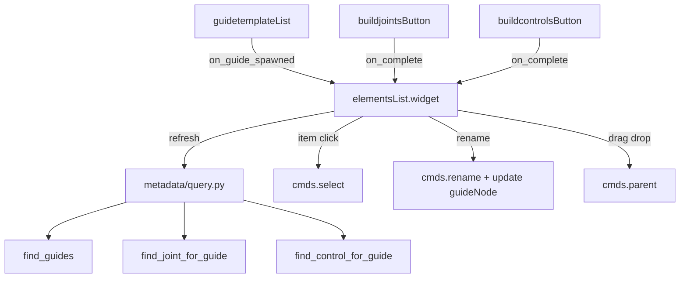

# Phase 4 — Elements UI Widget

Supplement to [`PROGRESS.md`](../PROGRESS.md). Phase 3 complete; you are here.

---

## Goal

Add an **Elements** panel to the RigBox UI that displays the current rig scene:

- **Guide hierarchy** — mirrors Maya parenting (same as Outliner for guides)
- **Built elements** — joint and control under each guide (via `guideNode`)
- **Scene sync** — click item → select in Maya; Refresh after spawn/build
- **Guide editing** — rename and reparent guides from the tree (optional sub-phase)

---

## Target UI layout

```
┌─────────────────────────┐
│        RigBox           │
├─────────────────────────┤
│    Guide Templates      │
│    (existing list)      │
├─────────────────────────┤
│       Elements          │  ← new
│  ▼ fk_guide             │
│      fk_jnt             │
│      fk_ctrl            │
│    ▼ fk_guide1          │
│      fk_jnt1            │
│      fk_ctrl1           │
│  [Refresh]              │
├─────────────────────────┤
│    Build Joints         │
│    Build Controls       │
└─────────────────────────┘
```

---

## Architecture



---

## Step 1 — Create `ui/widgets/elementsList.py`

New widget following the `guidetemplateList` frame pattern (title + framed content).

### Widgets

| Widget | Purpose |
|--------|---------|
| `QLabel` | Title: `Elements` |
| `QTreeWidget` | Hierarchy display (`setHeaderHidden(True)`) |
| `QPushButton` | `Refresh` |

### `refresh()` — build the tree

1. `self.tree.clear()`
2. `guides = query.find_guides()`
3. Create a `QTreeWidgetItem` per guide; store Maya node name in `UserRole`:

```python
item.setData(0, QtCore.Qt.ItemDataRole.UserRole, guide)
item.setData(0, QtCore.Qt.ItemDataRole.UserRole + 1, 'guide')  # optional type tag
```

4. **Parent guides** using Maya hierarchy:

```python
parents = cmds.listRelatives(guide, parent=True) or []
parent_guide = next((p for p in parents if p in guide_set), None)
```

5. **Add built children** under each guide (read-only items):

```python
joint = query.find_joint_for_guide(guide)
if joint:
    j_item = QtWidgets.QTreeWidgetItem([joint])
    j_item.setData(0, QtCore.Qt.ItemDataRole.UserRole, joint)
    j_item.setData(0, QtCore.Qt.ItemDataRole.UserRole + 1, 'joint')
    j_item.setFlags(j_item.flags() & ~QtCore.Qt.ItemFlag.ItemIsEditable)
    guide_item.addChild(j_item)

control = query.find_control_for_guide(guide)
# same pattern for control
```

6. `expandAll()` after building

Call `self.refresh()` at end of `__init__`.

---

## Step 2 — Tree click → Maya selection

```python
def _on_tree_selection_changed(self):
    items = self.tree.selectedItems()
    if not items:
        return
    node = items[0].data(0, QtCore.Qt.ItemDataRole.UserRole)
    if node and cmds.objExists(node):
        cmds.select(node, replace=True)
```

Use a `_updating_selection` flag if you later add Maya → tree sync (not required for Phase 4).

---

## Step 3 — Refresh wiring across UI

Add optional callbacks to existing widgets (minimal change):

### `guidetemplateList.py`

```python
def __init__(self, on_guide_spawned=None):
    self.on_guide_spawned = on_guide_spawned
    # ...
    # end of on_item_clicked:
    if self.on_guide_spawned:
        self.on_guide_spawned()
```

### `buildjointsButton.py` / `buildcontrolsButton.py`

```python
def __init__(self, on_complete=None):
    self.on_complete = on_complete
    # ...
    # end of click handler:
    if self.on_complete:
        self.on_complete()
```

### `mainWindowUI.py`

```python
self.elements_widget = elementsList.widget()
refresh = self.elements_widget.refresh

self.guide_list_widget = guidetemplateList.widget(on_guide_spawned=refresh)
self.build_joints_button = buildjointsButton.widget(on_complete=refresh)
self.build_controls_button = buildcontrolsButton.widget(on_complete=refresh)

# layout: templates → elements → build buttons
main_layout.addWidget(self.elements_widget)  # between templates and buttons
```

Remove or reduce `addStretch()` above templates so the tree has room.

---

## Step 4 — Guide rename (optional sub-phase 4b)

Enable rename on **guide items only**:

```python
item.setFlags(item.flags() | QtCore.Qt.ItemFlag.ItemIsEditable)
```

Connect `itemChanged`:

```python
def _on_item_renamed(self, item, column):
    old_name = item.data(0, QtCore.Qt.ItemDataRole.UserRole)
    new_name = item.text(0)
    if not old_name or old_name == new_name:
        return
    actual_name = cmds.rename(old_name, new_name)
    item.setData(0, QtCore.Qt.ItemDataRole.UserRole, actual_name)
    item.setText(0, actual_name)
    self._update_guide_node_refs(old_name, actual_name)  # see below
```

**Important:** Joints/controls store `guideNode` as a locked string. After renaming a guide, update linked built nodes or `find_joint_for_guide` breaks:

```python
def _update_guide_node_refs(self, old_name, new_name):
    import maya.cmds as cmds
    from metadata.query import query, ATTR_GUIDE_NODE
    for node in query.find_joints() + query.find_controls():
        if cmds.getAttr(f'{node}.{ATTR_GUIDE_NODE}') == old_name:
            attr = f'{node}.{ATTR_GUIDE_NODE}'
            cmds.setAttr(attr, lock=False)
            cmds.setAttr(attr, new_name, type='string')
            cmds.setAttr(attr, lock=True)
```

Skip rename in Phase 4a if you want a smaller first pass.

---

## Step 5 — Guide reparent via drag-drop (optional sub-phase 4c)

On guide items only:

```python
self.tree.setDragDropMode(QAbstractItemView.InternalMove)
```

Connect `rowsMoved` (or handle `dropEvent` override) to call:

```python
cmds.parent(guide, parent_guide)  # or world=True for root
```

Only allow drag on guide items — joints/controls should not be draggable.

**Guard:** use `query.is_guide(parent_guide)` before parenting (same rule as guide spawn).

---

## Files to touch

| File | Changes |
|------|---------|
| `ui/widgets/elementsList.py` | **new** — tree, refresh, selection |
| `ui/mainWindowUI.py` | Import, layout, refresh wiring |
| `ui/widgets/guidetemplateList.py` | Optional `on_guide_spawned` callback |
| `ui/widgets/buildjointsButton.py` | Optional `on_complete` callback |
| `ui/widgets/buildcontrolsButton.py` | Optional `on_complete` callback |

No changes to `modules/` or `metadata/` required — query API is already sufficient.

---

## How to test in Maya

1. `show()` → Elements panel visible between templates and build buttons
2. Spawn `fk_guide` → tree shows guide (Refresh auto or manual)
3. Spawn child FK under first guide → nested tree reflects Outliner
4. **Build Joints** → `fk_jnt` appears under `fk_guide`
5. **Build Controls** → `fk_ctrl` appears under `fk_guide`
6. Click `fk_jnt` in tree → selected in viewport
7. Click Refresh after manual Outliner delete → tree updates

**Multi-guide chain test:** two parented guides, full build — tree shows two roots or nested guides each with jnt + ctrl children.

---

## Phase 4 exit criteria

### 4a (minimum)

- [ ] `elementsList.py` widget with guide hierarchy
- [ ] Joint/control shown as children via `find_*_for_guide`
- [ ] Click item selects Maya node
- [ ] Refresh button works
- [ ] Auto-refresh after spawn / Build Joints / Build Controls

### 4b (optional polish)

- [ ] Rename guide from tree + `guideNode` attrs updated
- [ ] Drag-drop reparent guides in tree

---

## Edge cases

| Case | Expected behavior |
|------|-------------------|
| No guides | Empty tree |
| Joints not built yet | Guide item with no children |
| Duplicate guide names | Maya suffixes (`fk_guide1`) — tree shows actual names |
| Delete node in Outliner | Gone on next Refresh |
| `rig_GRP` | Not shown in tree (controls listed under guides is enough for Phase 4) |

---

## Suggested pacing

| Sub-phase | Scope |
|-----------|-------|
| **4a** | Tree display + refresh + selection + UI wiring |
| **4b** | Guide rename with `guideNode` sync |
| **4c** | Drag-drop reparent |

Check in after 4a or when all desired sub-phases are done.

---

## After Phase 4

**Phase 5** — Humanoid guides/modules (Root, Spine, limbs) — Elements tree scales automatically via `find_guides()` hierarchy.

**Phase 6** — Skin button + bind utility.
