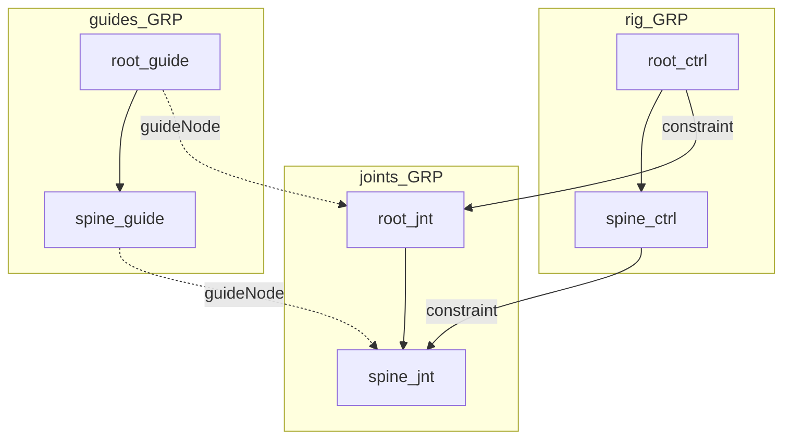
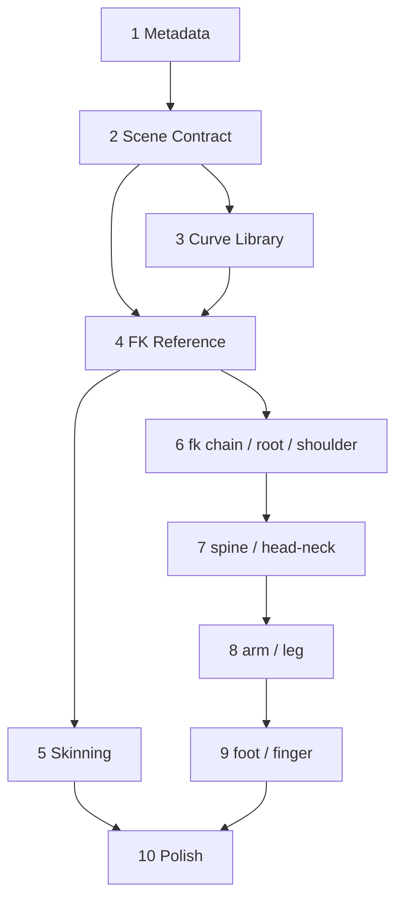

# RigBox Project Plan

Roadmap for RigBox, a Python-based modular autorigger for Autodesk Maya.

**Authority:** This plan implements the goals defined in [`.cursor/rules/rigbox-project.mdc`](../.cursor/rules/rigbox-project.mdc). Where the two disagree, the rules file wins and this plan should be corrected.

**Workflow:** The user writes all code. The agent supplies phase breakdowns, reviews work against exit criteria, and maintains these documents.

**Related docs:** [`PROGRESS.md`](../PROGRESS.md) (status) · [`METADATA_SCHEMA.md`](METADATA_SCHEMA.md) (metadata contract) · [`archive/`](archive/README.md) (superseded plans)

---

## 1. Target pipeline

RigBox drives a four-step build. Each step reads scene metadata written by the step before it.

| Step | Input | Output |
|------|-------|--------|
| **1. Guide** | Template selection + user placement | Tagged guide locators under `guides_GRP` |
| **2. Joints** | Guides + guide metadata | Joints under `joints_GRP`; deform joints under `deform_GRP` and in the `deform_skeleton` set |
| **3. Controls** | Guides + built joints | Controls and effectors under `rig_GRP`, constrained to joints; controls in the `controls` set |
| **4. Skinning** | Selected mesh + `deform`-tagged joints | `skinCluster` binding |

The build orchestrator resolves which module script to call for each guide via [`guides/templates.json`](../guides/templates.json), keyed on the guide's `module` metadata.

### Scene organization

Joint and control hierarchies **mirror** the guide hierarchy, so a nested guide produces a nested joint and a nested control.

---

## 2. Where the code stands today

Verified by inspection on 2026-08-06.

| Area | File | State |
|------|------|-------|
| Tagging | [`metadata/tag.py`](../metadata/tag.py) | String attributes only — no boolean or enum support |
| Query | [`metadata/query.py`](../metadata/query.py) | `is_/find_` helpers for guide, joint, control; no effector, deform, kinematics, or hierarchy helpers |
| Guide base | [`guides/base/guide.py`](../guides/base/guide.py) | Spawns locator, tags 4 attrs, parents under a selected guide; no `guides_GRP` |
| FK guide | [`guides/fk/guide.py`](../guides/fk/guide.py) | Pass-through subclass |
| Module base | [`modules/base/module.py`](../modules/base/module.py) | `_create_joint`, `_create_control`, `_tag_node`, `_rig_group`; names derive from `module` metadata, causing collisions |
| FK module | [`modules/fk/module.py`](../modules/fk/module.py) | Builds one joint and one control; `parentConstraint` only; not idempotent; no hierarchy mirroring |
| Orchestrator | [`modules/build.py`](../modules/build.py) | Loops guides in arbitrary order; no rebuild entry point |
| UI | [`ui/mainWindowUI.py`](../ui/mainWindowUI.py) | Dockable window with template list, Elements tree, Build Joints, Build Controls |
| Elements tree | [`ui/widgets/elementsList.py`](../ui/widgets/elementsList.py) | Hierarchy display, rename with `guideNode` sync, drag-drop reparent with cycle guard |
| Templates | [`guides/templates.json`](../guides/templates.json) | Entries for `fk`, `ik chain`, `Root`, `Spine`; only `fk` has Python behind it |
| Curve library | [`curves/curve_library.json`](../curves/curve_library.json) | Empty file; no reader or writer |

### Gaps against the current goals

1. Metadata is missing `deform` and `kinematics`; `side` is a string rather than an enum; `effector` is not a recognized `componentType`.
2. No `guides_GRP`, `joints_GRP`, or `deform_GRP`; no `deform_skeleton` or `controls` selection sets.
3. Joint and control names collide when a module has more than one guide, so guide-to-node pairing is unreliable.
4. Rebuilding duplicates nodes instead of updating them.
5. Controls are raw `cmds.circle` output rather than shapes from a curve library.
6. There is no skinning step.
7. Only the `fk` module exists; `ik chain` is registered in templates but is not a module in the current goals — IK belongs to `arm` and `leg`.

---

## 3. Phase roadmap

Phases 1 through 5 build one complete vertical slice of the pipeline using only the FK module. Phases 6 through 9 broaden the module library. Phase 10 is release work.

| Phase | Name | Delivers |
|-------|------|----------|
| **1** | Metadata Foundation | Typed attributes, full six-attribute schema, extended query API |
| **2** | Scene Contract | Groups, selection sets, guide-derived naming, hierarchy mirroring, idempotent build |
| **3** | Control Curve Library | `curve_library.json` format, reader, and capture tool |
| **4** | FK Reference Module | `fk` conformed to the full contract as the pattern all modules copy |
| **5** | Skinning Step | Skin button and `skinCluster` binding — completes the four-step pipeline |
| **6** | Simple Modules | `fk chain`, `root`, `shoulder` |
| **7** | Torso Modules | `spine`, `head/neck` |
| **8** | Limb Modules | `arm`, `leg` with IK/FK switching |
| **9** | Extremity Modules | `foot` reverse-foot system, `finger` curl |
| **10** | Polish and Distribution | Install path, shelf button, error handling, docs |

---

## Phase 1 — Metadata Foundation

**Goal:** Every RigBox node carries the full metadata set with correct Maya attribute types.

**Why first:** Every later phase queries these attributes. `deform` gates skinning, `kinematics` gates IK/FK switching, and `side` drives mirroring. Adding them after modules exist would mean retagging every module.

| File | Work |
|------|------|
| [`metadata/tag.py`](../metadata/tag.py) | Support `string`, `bool`, and `enum` attribute types |
| [`metadata/query.py`](../metadata/query.py) | Attribute constants, enum value constants, readers that handle non-string types, `is_effector`, `find_effectors`, `find_deform_joints` |
| [`guides/base/guide.py`](../guides/base/guide.py) | Tag guides with all applicable attributes |
| [`modules/base/module.py`](../modules/base/module.py) | Tag built nodes with `componentType`, `guideNode`, `module`, `subModule`, `side`, plus `deform` on joints and `kinematics` where relevant |
| [`docs/METADATA_SCHEMA.md`](METADATA_SCHEMA.md) | Keep in sync as the written contract |

**Exit criteria**

- [ ] `tag.create` writes string, boolean, and enum attributes, all lockable
- [ ] Guides carry `componentType`, `module`, `subModule`, `side`
- [ ] Joints carry `componentType`, `guideNode`, `module`, `subModule`, `side`, `deform`, `kinematics`
- [ ] Controls and effectors carry `componentType`, `guideNode`, `module`, `subModule`, `side`, `kinematics`
- [ ] `side` and `kinematics` read back as enum labels, not raw indices
- [ ] Query helpers exist for effectors and deform joints
- [ ] `METADATA_SCHEMA.md` matches the code

Detailed breakdown: [`PHASE_1.md`](PHASE_1.md)

---

## Phase 2 — Scene Contract

**Goal:** A predictable, rebuildable scene structure that all modules share.

**Why now:** Fixes the naming collisions and duplicate-build behavior that currently make multi-guide modules impossible.

| File | Work |
|------|------|
| [`modules/base/module.py`](../modules/base/module.py) | Group constants and helpers; guide-derived naming; xform sync; hierarchy parenting; constraint replacement; selection set membership |
| [`guides/base/guide.py`](../guides/base/guide.py) | Root guides parent under `guides_GRP` |
| [`metadata/query.py`](../metadata/query.py) | `find_parent_guide`, `sort_guides_hierarchy`, duplicate-pairing warnings |
| [`modules/build.py`](../modules/build.py) | Build in parent-before-child order; add `rebuild_rig()` |
| [`ui/widgets/elementsList.py`](../ui/widgets/elementsList.py) | Reparent to `guides_GRP` instead of world |
| `ui/widgets/rebuildrigButton.py` | New Rebuild Rig button |
| [`ui/mainWindowUI.py`](../ui/mainWindowUI.py) | Wire the new button |

**Naming rule:** strip `_guide` from the guide transform name, then append the suffix. `L_upperArm_guide` produces `L_upperArm_jnt` and `L_upperArm_ctrl`. Built node names never contain `guide`; the `guideNode` attribute still stores the full guide name for pairing.

**Exit criteria**

- [ ] `guides_GRP`, `joints_GRP`, `deform_GRP`, `rig_GRP` created on demand
- [ ] `deform_skeleton` and `controls` selection sets populated
- [ ] Joint and control hierarchies mirror the guide hierarchy
- [ ] Names are unique per guide and omit `guide`
- [ ] Re-running a build updates nodes in place instead of duplicating them
- [ ] Rebuild Rig repositions joints and controls after guides move
- [ ] No "already connected" constraint errors on rebuild

---

## Phase 3 — Control Curve Library

**Goal:** Controls are built from named shapes stored in [`curves/curve_library.json`](../curves/curve_library.json) rather than hardcoded circles.

| File | Work |
|------|------|
| `curves/library.py` | New — read a named shape, build the curve, write a selected curve back to the library |
| [`curves/curve_library.json`](../curves/curve_library.json) | Populate with a starter shape set (circle, square, cube, arrow, pin, sphere) |
| [`modules/base/module.py`](../modules/base/module.py) | `_create_control` accepts a shape name and color |
| `ui/widgets/curveLibraryTool.py` | New — capture the selected curve into the library |
| [`ui/mainWindowUI.py`](../ui/mainWindowUI.py) | Expose the capture tool |

**Format:** each entry stores control-vertex points, curve degree, periodicity, and a default color, so a shape round-trips through capture and rebuild without loss.

**Exit criteria**

- [ ] Library JSON has a documented schema and a starter shape set
- [ ] A control can be built by shape name
- [ ] Selecting a NURBS curve and running the capture tool adds it to the library
- [ ] A captured shape rebuilds identically
- [ ] Control color is data-driven, not hardcoded

---

## Phase 4 — FK Reference Module

**Goal:** Bring `fk` fully in line with Phases 1 through 3 so it is the template every other module copies.

Per the module goals: a single guide, which may parent or child another module, generating one joint parent-constrained to one control.

| File | Work |
|------|------|
| [`modules/fk/module.py`](../modules/fk/module.py) | Idempotent `build_joints` / `build_controls`; full metadata; library-driven control shape; `parentConstraint` plus `orientConstraint` |
| [`guides/fk/guide.py`](../guides/fk/guide.py) | Accept `side` from the template |
| [`guides/templates.json`](../guides/templates.json) | Remove or repurpose the `ik chain` entry; add sided FK variants |
| [`docs/MODULE_AUTHORING.md`](MODULE_AUTHORING.md) | New — the checklist for writing any module, derived from FK |

**Exit criteria**

- [ ] Two FK guides, one nested under the other, build mirrored joint and control chains
- [ ] The joint is tagged `deform = true` and joins `deform_skeleton`
- [ ] The control is tagged `kinematics = FK` and joins `controls`
- [ ] Sided guides produce correctly sided names and metadata
- [ ] `MODULE_AUTHORING.md` describes the pattern well enough to write a new module from it

---

## Phase 5 — Skinning Step

**Goal:** Complete the four-step pipeline end to end with only the FK module in play.

| File | Work |
|------|------|
| `modules/skin/skin.py` | New — bind selected meshes to `deform`-tagged joints |
| `ui/widgets/skinButton.py` | New — Skin button |
| [`ui/mainWindowUI.py`](../ui/mainWindowUI.py) | Wire the button |

Binding uses the `deform_skeleton` set as the influence list, so the `deform` tag is the single source of truth for what skins.

**Exit criteria**

- [ ] With a mesh selected, Skin creates a working `skinCluster`
- [ ] Only `deform`-tagged joints appear as influences
- [ ] No mesh selected produces a clear message rather than an error
- [ ] Guides to skinned mesh works end to end in one session

---

## Phase 6 — Simple Modules

| Module | Guides | Output | Constraint |
|--------|--------|--------|------------|
| `fk chain` | N guides in a chain, N from a dialog | FK joint chain, one control per joint | May parent or child another module |
| `root` | Single guide | One joint with three nested controls: Global, Local, Root | May parent another module; may **not** be a child |
| `shoulder` | Single guide | One joint and one control | Intended under a spine chest |

New files per module: `guides/<name>/guide.py`, `modules/<name>/module.py`, plus a [`templates.json`](../guides/templates.json) entry. Shared work: a chain-count dialog widget and query helpers that group the guides belonging to one module instance.

**Exit criteria**

- [ ] The chain dialog spawns N chained guides
- [ ] Root builds its three-tier control hierarchy and refuses to be parented under another guide
- [ ] Shoulder builds sided and parents to a spine chest
- [ ] Parenting rules are enforced, not merely documented

---

## Phase 7 — Torso Modules

| Module | Guides | Output |
|--------|--------|--------|
| `spine` | N guides in a chain, N from a dialog | COG joint from the base guide, N-1 spine joints, chest at the end; pelvis/COG and spine controls |
| `head/neck` | 3 neck guides chained, plus 1 head guide under the last neck guide | 3 neck joints and 1 head joint with controls |

`head/neck` may be a child of another module but may **not** be a parent.

**Exit criteria**

- [ ] Spine builds COG, spine segments, and chest in the correct order
- [ ] Head/neck parents to the spine chest and builds four joints
- [ ] Head/neck refuses to parent another module
- [ ] Root, spine, and head/neck assemble into a working torso

---

## Phase 8 — Limb Modules

| Module | Guides | Output |
|--------|--------|--------|
| `arm` | Upper arm, lower arm, wrist | 3 joints; IK and FK controls, pole vector, switch attribute |
| `leg` | Upper leg, lower leg, ankle | 3 joints; IK and FK controls, pole vector, switch attribute |

This phase introduces triple joint chains (bind, IK, FK) blended by the switch. The `kinematics` attribute from Phase 1 distinguishes them, and IK handles and pole vectors are tagged `componentType = effector`.

**Exit criteria**

- [ ] Arms build under shoulders; legs build under the spine COG
- [ ] The switch attribute blends IK and FK without popping
- [ ] Pole vectors are placed from their guides and tagged as effectors
- [ ] Only the bind chain is tagged `deform = true`
- [ ] Left and right build from mirrored guides with correct `side` metadata

---

## Phase 9 — Extremity Modules

| Module | Guides | Output |
|--------|--------|--------|
| `foot` | Ankle, ball, toe, plus 4 roll guides for foot roll L/R, toe roll, heel roll | 3 foot joints, a reverse-foot joint system, FK roll controls |
| `finger` | Metacarpal at index 0 plus N phalanges | One joint and one FK control per segment, plus a curl attribute |

`finger` may be a child but may **not** be a parent.

**Exit criteria**

- [ ] Foot parents to a leg ankle and its roll pivots work
- [ ] Finger curl drives the phalanges but not the metacarpal
- [ ] A full humanoid assembles: root, spine, head/neck, shoulders, arms, fingers, legs, feet
- [ ] The full humanoid skins to a mesh via the Phase 5 Skin button

---

## Phase 10 — Polish and Distribution

- Maya module descriptor or documented `sys.path` setup
- Shelf button that launches the UI
- User-facing error dialogs for missing modules, untagged nodes, and failed imports
- Mirroring utility that uses `side` metadata to build the opposite limb
- Public API cleanup in `__init__.py` files
- Installation and usage README

**Exit criteria**

- [ ] Documented install with no manual path editing
- [ ] Shelf button launches the UI
- [ ] Failures surface as dialogs rather than tracebacks

---

## 4. Deferred and out of scope

| Item | Status |
|------|--------|
| `metahuman` module | Pending — revisit after Phase 9 |
| `camera` module | Pending — revisit after Phase 9 |
| `hand` module | Deprecated — do not implement |
| `ik chain` as a standalone module | Not in the current goals; IK lives inside `arm` and `leg`. Remove the leftover template entry in Phase 4 |
| [`deprecated/`](../deprecated) v1 and v2 code | Reference only. Useful precedent for the reverse foot, roll system, and curve library, but must not be copied wholesale |

---

## 5. Open design questions

Resolve these before the phase that depends on them.

| Question | Blocks | Notes |
|----------|--------|-------|
| Is `deform_GRP` a child of `joints_GRP` holding only deform joints, with helper and IK joints elsewhere under `joints_GRP`? Or a sibling group? | Phase 2 | The rules require both `joints_GRP` and `deform_GRP` but do not state their relationship |
| Should `side` be encoded in guide names, for example `L_upperArm_guide`, or derived from metadata at build time? | Phase 2 | Affects the naming rule and the mirroring utility |
| Should the guide locator shape be replaced with a custom drawn shape for readability? | Phase 6 | Cosmetic; mGear and Hive both use custom guide shapes |

---

## 6. Working agreement

1. The agent produces a `docs/PHASE_N.md` breakdown before each phase starts.
2. The user implements manually.
3. The user checks in with *"Phase N done — please review"*.
4. The agent reviews against the exit criteria and updates [`PROGRESS.md`](../PROGRESS.md).
5. Only then does the next phase begin.
